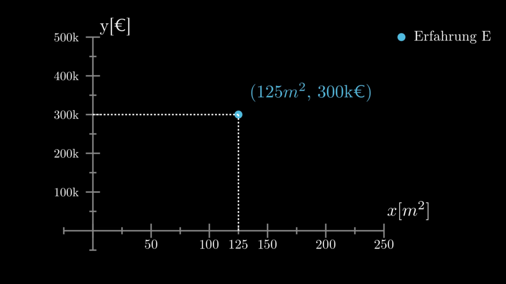
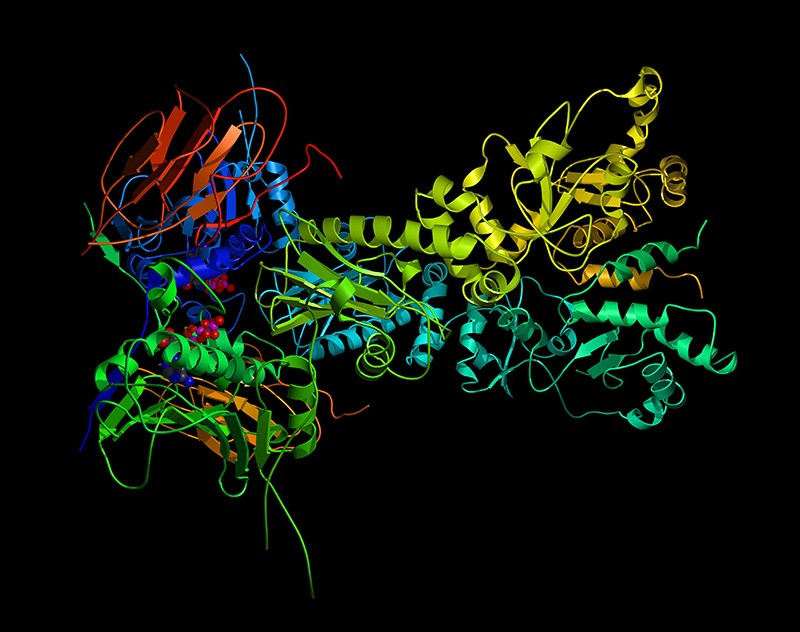

# Begriffserklärung

Wenn man in den Bereich des Machine Learning eintaucht, trifft man häufig auf die folgenden drei Begriffe: **Künstliche Intelligenz, Deep Learning** und eben den Begriff **Machine Learning** selbst. In den folgenden Abschnitten gehe ich genauer auf diese drei Begriffe ein und erläutere deren Zusammenhänge.

## Künstliche Intelligenz (KI)

Historisch gesehen trat zuerst der Begriff der **Künstlichen Intelligenz**, abgekürzt KI, auf. Häufig findet man hier auch den englischen Begriff Artificial Intelligence, abgekürzt AI. Mit **künstlicher Intelligenz** wird meist eine Maschine, etwa ein Computer, bezeichnet, der mittels seiner eingebauten Programmierung die kognitiven Fähigkeiten eines Menschen nachbilden kann. Probleme, vor die die Maschine gestellt wird, soll diese ohne menschliches Zutun möglichst fehlerfrei ausführen können und dabei möglichst „menschenähnlich“ agieren. 

Ein relativ klassisches Beispiel sind Computergegner in Videospielen, die aber oftmals nur intelligentes Verhalten nachahmen, jedoch in bestimmten Situationen sozusagen „kopflos“ agieren. Deshalb besiegen geübte Spieler häufig Computergegner selbst auf der höchsten Schwierigkeitsstufe mühelos, denn irgendwann kennen sie die Schwachstellen der KI und nutzen diese problemlos aus. Der Computergegner ist nicht fähig, auf diese Situationen adaptiv zu reagieren und begeht stets die gleichen Fehler.

Jedoch ist der Mensch nicht mehr in allen Spielen überlegen. Bei klassische Brettspielen mit festen Regeln und einer begrenzten Anzahl an Möglichkeiten sind Computer selbst von Weltmeistern oft nicht mehr zu schlagen. Am bekanntesten sind hier sicher der Schachcomputer Deep Blue, der 1996 den Weltmeister Gari Kasparov schlug und das von DeepMind entwickelte AlphaGo, welches 2015 den Europameister im Brettspiel Go schlug. Während Deep Blue noch auf klassischen Brute-Force-Algorithmen basierte, bei der einfach eine extrem hohe Anzahl an Zugmöglichkeiten durchgerechnet wurde, basiert AlphaGo auf Techniken des maschinellen Lernens.

## Machine Learning (ML)

Auch wenn die Begriffe häufig synonym verwendet werden, so ist **Machine Learning** nur ein Teilbereich der KI. So wird unter anderem der Schachcomputer Deep Blue sicherlich unter den Oberbegriff KI fallen, beinhaltet jedoch keine Aspekte von **Machine Learning**.

Statt feste Algorithmen zu implementieren, wird beim **Machine Learning** das Ziel verfolgt, einem Programm auf Basis einer hohen Datenmenge Wissen anzueignen. Das Programm soll sozusagen selbstständig lernen und das angelernte Wissen verallgemeinern, um es auf andere gleichwertige Daten anwenden zu können.  Dabei orientiert sich der Computer an einem vorgegebenen Gütekriterium und dem Informationsgehalt der Daten. Das Gütekriterium selbst wird vom Programmierer vorgegeben und kann entscheidenden Einfluss auf das Lernverhalten der Maschine haben.  Es existieren ganz unterschiedliche Herangehensweise und Modelle, die, je nach Problemstellung, ihre eigenen Vor- und Nachteile haben. 

## Deep Learning (DL)

Das derzeit wohl bekannteste Machine Learning Modell ist ein neuronales Netz und ab einer gewissen Größe des neuronalen Netzes spricht man vom **Deep Learning**. Es existiert jedoch keine exakte Definition, ab welcher Größe eines neuronalen Netzes man vom **Deep Learning** spricht. **Deep Learnin**g ist also wiederum nur ein Teilbereich des Machine Learnings. Beim **Deep Learning** können neuronale Netze verwendet werden, die aus mehreren Millionen Parametern bestehen. Die Möglichkeit, die Parameterwerte und das Zustandekommen von Ergebnissen zu interpretieren, ist bei solchen Netzen schwierig bis unmöglich. Zudem ist Deep Learning anfällig für Falschberechnungen durch manipulierte Eingangsdaten, wie subtil abgewandelte Bilder. 

Auf dem linken Bild wurde durch das Machine Learning Programm ein Panda identifiziert. Wird jedoch ein wenig Rauschen in das Bild hineingegeben, so erkennt das Programm stattdessen einen Gibbon (Affenart). Obwohl das Rauschen so gering ist, dass man es mit menschlichem Auge nicht erkennt und man es für das gleiche Bild halten würde, wird das neuronale Netz durch das Rauschen gestört und unterliegt einer Fehleinschätzung bei der Detektion der Tierart.

Nachdem die Bedeutung der Begriffe **Künstliche Intelligenz**, **Machine Learning** und **Deep Learning** nun geklärt ist, kann man sich deren Zusammenhänge grafisch wie folgt vorstellen:

## Definition Machine Learning Problem

Schauen wir uns dazu einmal die Definition eines wohl gestellten **Machine Learning Problems** von Tom M. Mitchell an, welches ich an dieser Stelle frei ins Deutsche übersetzt habe:

> Ein Computerprogramm lernt genau dann von einer Erfahrung E hinsichtlich einer Aufgabe A und einer Performancemessung p, wenn seine Performance hinsichtlich der Aufgabe A, gemessen durch p, durch die Erfahrung E steigt.  
Buch: Tom M. Mitchell, Machine Learning, S.2, 1997, ISBN: 978-0070428072

Nun das ganze klingt zunächst natürlich etwas kryptisch, deshalb schauen wir uns dazu einfach direkt mal ein Beispiel an. Nehmen wir an, wir wollen, dass ein Programm die Preise von Häusern auf Basis der Wohnfläche vorhersagt, dies wäre also die **Aufgabe A** des Programms. Die **Erfahrungen E** sind in diesem Fall Daten von bereits verkauften Häusern, über die der Verkaufspreis somit bekannt ist. Zusätzlich steht uns zu jedem verkauften Haus auch die Größe der Wohnfläche in Quadratmetern zur Verfügung. Eine **Erfahrung E** ist also der Verkaufspreis eines Hauses sowie dessen Wohnfläche. Die **Performancemessung p** kann in diesem Zusammenhang verschiedenen gestaltet werden. In diesem Beispiel bietet sich die quadratische Abweichung zwischen dem erzielten und dem geschätzten Verkaufspreis des Programms an.

Zusammengefasst sähe dieses Beispiel wie folgt aus:
- **Aufgabe A**: Vorhersage von Preise von Häusern
- **Erfahrung E**: Daten von bereits verkauften Häusern (Wohnfläche, Preis)
- **Performancemessung p**: Quadratische Abweichung zwischen geschätztem und realem Häuserpreis

## Analytische Darstellung

Wenn wir eine solche Machine Learning Aufgabe lösen wollen, suchen wir letztendlich nach einer Funktion $`f(x)`$, die uns das gewünschte Ergebnis liefert. Wir können also schreiben:

$`y = f(x)`$

Die Variable ist an dieser Stelle der **Input**, auch als **features** bezeichnet, auf dessen Grundlage das Ergebnis bzw. der **Output**, auch als **target variable** bezeichnet, berechnet wird. Die Funktion $`f(x)`$ wird auf Basis der vorhandenen Daten approximiert und kann sich je nach gewählter Methodik bzw. Modell stark unterscheiden.

In unserem Häuserpreisbeispiel von oben entspricht der Wohnfläche eines Hauses, auf dessen Basis wir den Preis eines Hauses, also $`y`$, berechnen wollen. Das bedeutet, ein Datenpunkt bzw. Wertepaar $`(x,y)`$ entspricht der **Erfahrung E**. Wenn uns mehr Daten über ein Haus zur Verfügung stehen, wie zum Beispiel die Anzahl der Stockwerke oder die Größe des Gartens, dann ist nicht bloß ein Skalar, sondern ein Vektor $`x = [x_0, x_1, x_2, ...]`$. Doch der Einfachheit halber bleiben wir erst einmal bei dem skalaren Fall. Im Übrigen kann es sich auch bei ebenfalls um einen Vektor handeln, aber auch das lassen wir an dieser Stelle einmal außen vor.

Die Funktion $`f(x)`$ entspricht sozusagen die Lösung unserer **Aufgabe A**, denn mittels der Funktion $`f(x)`$ lässt sich auf Basis der Wohnfläche $`x`$ eines Hauses dessen Preis vorhersagen. Jedoch lässt sich in der Regel keine exakte Funktion $`f(x)`$ berechnen, die die Inputdaten $`x`$ exakt auf den gewünschten Output $`y`$ abbilden kann. Ich bezeichne daher einmal die berechnete Approximation der Funktion $`f(x)`$ als $`\tilde{f}(x)`$, sodass gilt:

$`y \approx \tilde{f}(x)`$

Haben wir nun die Wohnfläche für ein Haus gegeben, so können wir dessen Preis mit der Funktion vorhersagen. Wird das Haus jetzt zu einem Preis
verkauft, können wir die quadratische Abweichung zwischen unserer Preisschätzung und dem wirklichen Verkaufspreis
ermitteln. Das entspricht dann unserer Performancemessung p. Anschließend kann man auf Basis dieser neuen Erfahrung
und der Performancemessung p die Funktion verbessern. Das Programm „lernt“ also quasi durch diese neue Erfahrung.

## Grafische Darstellung

Schauen wir uns diesen Prozess nun einmal grafisch an. In dem unteren Bild ist auf der x-Achse die Wohnfläche in Quadratmetern aufgetragen und auf der y-Achse der Preis der Häuser in €. Der blaue Punkt im Graphen repräsentiert ein Haus mit $`125m^{2}`$, das für 300.000€ (abgekürzt 300k€) verkauft wurde. Dies entspricht also einer **Erfahrung E**, wobei diese Punkte in der Regel als **Datenpunkte** bezeichnet werden.

Betrachten wir einmal eine größere Menge an Erfahrungen bzw. Datenpunkten und ermitteln eine Funktion $`\tilde{f}(x)`$
, welches möglichst nah an den **Erfahrungen E** respektive Datenpunkten entlangläuft und damit der Lösung der **Aufgabe A** entspricht.  Als Ansatz habe ich für $`\tilde{f}(x)`$ ein quadratisches Polynom der Form $`\tilde{f}(x) = ax^{2} + bx + c`$ gewählt. 

Auf Grundlage der **Performancemessung p**, welcher den quadratischen Abstand zwischen einer **Erfahrung E** und der Vorhersage, also dem roten Graphen, berechnet, wurden die Parameter a,b und c so gewählt, dass dieser Abstand möglichst klein ist. Zwar ist der berechnete Graph nun möglichst nah an den blauen Datenpunkten, jedoch kann er die Realität natürlich nur in begrenztem Maße wiedergeben. Wie weiter oben bereits gesagt, ist die Berechnung einer exakten Funktion $`f(x)`$, die alle Datenpunkte exakt abbildet, in der Regel nicht möglich. So haben Häuser unter etwa $`10m^{2}`$ etwa einen negativen Preis und der Preis für Häuser sinkt ab etwa $`175m^{2}`$ Wohnfläche wieder nach unten.

Erhält respektive erhebt man eine neue **Erfahrung E** kann man die **Performance p**, also den Abstand zur aktuell berechneten Funktion $`\tilde{f}(x)`$ erneut bestimmen und auf Basis dessen die Parameter a, b und c der Funktion verbessern. Dieses Vorgehen kann man theoretisch so oft wiederholen, wie man möchte oder Daten zur Verfügung stehen.

### Overfitting

Jetzt könnte man natürlich auf die Idee kommen, ein Polynom höherer Ordnung zu verwenden, um die Datenpunkte noch exakter abbilden zu können. Verwendet man jedoch ein Polynom mit zu hoher Ordnung, kann das folgende passieren. 

Zwar läuft das Polynom 7. Ordnung durch alle acht Datenpunkte, fängt jedoch, hauptsächlich an den Rändern, an zu oszillieren. Dieses Problem beim Machine Learning bezeichnet man auch als **Overfitting**. Die berechnete Funktion kann zwar sehr genau die Werte für die verwendeten Daten vorhersagen, jedoch können bei der Vorhersage unbekannter Daten große Abweichungen auftreten.

### Underfitting

Im Gegensatz dazu kann das folgende passieren, wenn man ein Polynom zu niedriger Ordnung, in diesem Beispiel eine einfache Konstante, wählt. 

Der ermittelte Graph liegt zum Teil weit abseits der blauen Punkte und ist keine gute Approximation der Wirklichkeit, da hier jedes Haus unabhängig von seiner Wohnfläche das Gleiche kosten würde. Dieses Problem bezeichnet man auch als **Underfitting**. Die ermittelte Funktion ist zu simpel oder anders ausgedrückt, enthält zu wenige Parameter, um die Daten wirklichkeitsgetreu approximieren zu können.

## Anwendungsbereiche Machine Learning

Zum Ende dieses Artikels möchte ich noch einen kurzen Überblick darüber geben, in welchen Bereichen Machine Learning bereits eingesetzt wird. Die folgende Liste ist mit Sicherheit nicht vollständig, sie soll nur einen kleinen Überblick darüber geben, was alles mit Machine Learning möglich ist.

### Astronomie

In der Astronomie können beispielsweise Machine Learning Modelle eingesetzt werden, um Cluster von Asteroiden zu ermitteln.

### Autonomes Fahren

Speziell im Bereich des autonomen Fahrens ist das Machine Learning weitverbreitet. So wurden auf dem Bild unten verschiedene Objekte wie Fahrzeuge und Verkehrszeichen detektiert, die bei der Fahrtplanung des autonomen Fahrzeugs berücksichtigt werden müssen.

### Biologie

In der Biologie wird Machine Learning eingesetzt, um die dreidimensionale Struktur von Proteinen zu ermitteln. Mit traditionellen Algorithmen war diese Aufgabe bisher nicht oder nur kaum zu lösen.

### Medizin

In der Medizin wird zum Beispiel in der Tumorerkennung Machine Learning angewendet. So können Ärzte bei Ihrer Arbeit unterstützt werden.

### Weitere Anwendungsgebiete

Weitere Anwendungsbereiche für Machine Learning sind zum Beispiel noch die Spracherkennung, Werbung, Qualitätsprüfung oder die IT-Sicherheit. Quasi in allen Bereichen des Lebens wird man direkt oder indirekt mit Machine Learning in Berührung kommen und das meist ohne es überhaupt zu bemerken.

## Zusammenfassung Machine Learning Einführung

Machine Learning ist ein Teilbereich der künstlichen Intelligenz, die das Ziel verfolgt, einem Programm auf Basis einer hohen Datenmenge Wissen anzueignen, statt feste Algorithmen vorzugeben. Letztendlich wird in einem Machine Learning Problem versucht eine Funktion zu approximieren, die die Eingangsdaten möglichst gut auf die Ausgangsdaten abbildet. Diese Funktion unterscheidet sich je nach verwendetem Machine Learning Modell und kann Millionen von Parametern enthalten. Häufig kann das Verhalten solch einer Funktion mit dem menschlichen Verstand nicht mehr oder nur mit sehr viel Aufwand nachverfolgt werden. Bereits heute gibt es eine Vielzahl von Anwendungsgebieten für Machine Learning und jeden Tag werden auf diesem Gebiet neue Entdeckungen gemacht und Ideen verwirklicht.

## Links
[https://www.youtube.com/watch?v=tCApwsdijDk&list=PLNdSza1vBfZYh7gce5lctv1K1Xm3JjF-w](https://www.youtube.com/watch?v=tCApwsdijDk&list=PLNdSza1vBfZYh7gce5lctv1K1Xm3JjF-w)

# Einführung

