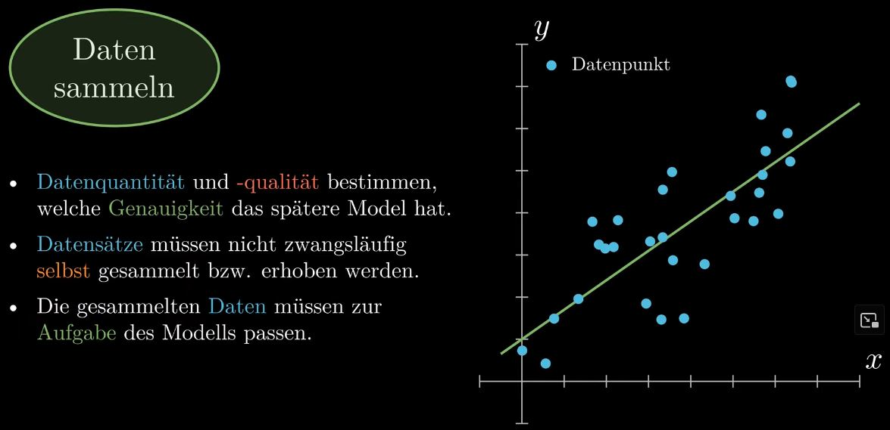
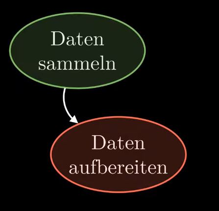
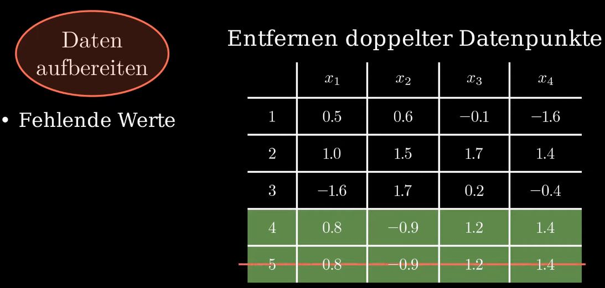
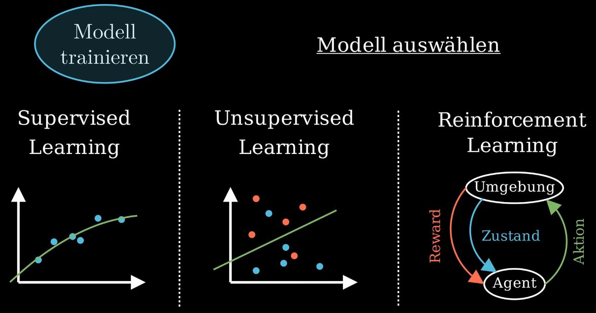

# Machine Learning Workflow

Zum Verständnis des Artikels solltet ihr eine grundlegende Vorstellung davon haben, was ein Machine Learning Problem eigentlich ist beziehungsweise wissen, was ein Modell im Kontext des Machine Learnings ist und wie man mit diesem eine Prädiktion berechnet.

In dem genannten Artikel wird auch ein Beispiel zur Prädiktion von Häuserpreisen erläutert, welches ich in diesem Artikel immer wieder aufgreife. Ich wiederhole das Beispiel daher hier kurz, wer mit dem Beispiel bereits bekannt ist, kann den folgenden Absatz einfach überspringen.

In dem genannten Häuserpreisbeispiel soll ein Machine Learning Modell entwickelt werden, welches die Preise von Häusern auf Basis der Größe des Hauses in Quadratmetern, der Anzahl der Stockwerke usw. vorhersagt. Die Daten, aus dem das Modell entwickelt werden soll, enthalten Informationen über bereits verkaufte Häuser. Insbesondere der Verkaufspreis, also die Größe, die das Modell prädizieren soll, ist also in diesen Daten enthalten. Die Performance des Modells wird über die (quadrierte) Abweichung zwischen dem prädizierten und wirklichen Verkaufspreis eines Hauses gemessen.

## Schritt 1: Daten sammeln

Im ersten Schritt zur Lösung eines Machine Learning Problems müssen zunächst einmal die Daten erhoben werden, auf denen das spätere Machine Learning Modell basieren soll. Datenquantität und -qualität bestimmen in einem erheblichen Maße, welche Genauigkeit später erreichbar ist. So kann eine größere Anzahl an unvollständigen Datenpunkten dazu führen, dass die Genauigkeit des Modells sinkt. Unvollständigen Datenpunkten werden von mir als solche bezeichnet, denen eine oder mehrere Informationen bzw. Features fehlen. Zum Beispiel kann das beim oben erwähnten Häuserbeispiel bedeuten, dass die Anzahl der Stockwerke oder die Größe der Wohnfläche von einem Haus fehlt. 

Aber auch die Varianz der Daten kann einen Einfluss auf die Berechnung haben. Auf dem unteren Bild führt eine lineare Regression aller Punkte durch den Ursprung des Koordinatensystems.

Haben die Datenpunkte jedoch eine größere Varianz, wie auf dem folgenden Bild zu sehen, so kann sich das Ergebnis, in diesem Beispiel die lineare Regression, verändern. Normalerweise gilt, je größer die Varianz in den Daten ist, desto mehr Daten benötigt man, um diese auszugleichen.

In vielen Fällen ist es gar nicht notwendig selbst Daten zu erheben, sondern man kann auf verschiedene Webseiten bzw. Datenbanken zurückgreifen, zum Beispiel kaggle.com. Letztendlich müssen die gesammelten Daten natürlich auch zur späteren Aufgabe des Modells passen. So bringt es einem vermutlich wenig Häuser in einem Preisbereich ab 800.000 € schätzen zu wollen, wenn einem nur Daten von Häusern bis 500.000 € Verkaufspreis zur Verfügung stehen.

## Schritt 2: Daten aufbereiten

Nachdem man die Daten gesammelt hat, geht es nun meist daran, diese Daten erst einmal aufzubereiten. Betrachten wir dazu einmal die folgende Datentabelle.

Die Spalten stellen die einzelnen Features , usw. dar. Ein Feature wäre etwa die Wohnfläche eines Hauses. In den einzelnen Zeilen sind die einzelnen Datenpunkte 1, 2, 3 usw. aufgelistet. Für jeden Datenpunkt gibt es also einen Eintrag für jedes Feature. 

Möchte man jetzt ein Machine Learning Modell mit diesen Daten anlernen, so sind zuvor einige Schritte zu unternehmen, damit das Modell mit diesen Daten bestmöglich arbeiten kann.

### Umgang mit fehlenden oder doppelten Daten

In der Realität **fehlen** häufig einzelne Features eines Datenpunktes aufgrund von Messfehlern oder weil Datensätze zusammengeführt werden, die nicht über exakt die gleichen Features verfügen.

Es gibt verschiedene Möglichkeiten, mit **fehlenden Werten** umzugehen. Zum einen könnte man den ganzen Datenpunkt löschen, das ist aber nur sinnvoll, wenn es wirklich nur sehr wenige Datenpunkte betrifft, denn sonst gehen natürlich viele Informationen verloren. Eine andere Option ist die Verwendung des Mittelwertes oder des Medians eines Features, um die fehlenden Werte zu bestimmen. Inzwischen gibt es auch verschiedenen Algorithmen oder eigene Machine Learning Modelle um fehlende Daten zu ermitteln. Letztendlich muss jeder selbst entscheiden, wie viel Aufwand er in diese Problematik steckt und wie man mit den **fehlenden Daten** umgeht.

Ein weiteres relativ häufig auftretendes Phänomen sind **doppelte Datenpunkte**, also Datenpunkte, die exakt die gleichen Werte enthalten. In diesem Fall bleibt einem nichts anderes übrig, als einen dieser Datenpunkte zu löschen, denn mit diesem Datenpunkt erhält man keine weiteren Informationen. Im Gegenteil, die gespeicherten Informationen werden sozusagen übergewichtet, da sie doppelt in das Training des Modells einfließen. Zudem kosten sie unnötig Rechenkapazität und Speicherplatz, wobei doppelte Datenpunkte in der Regel nicht so häufig auftreten, dass dieser Punkt ins Gewicht fällt.

### Encoding – Transformation zu numerischen Werten

Nicht selten findet man neben numerischen Zahlenwerten auch ganz normalen Text oder anders gesagt Strings in einem Datensatz vor. In der obigen Datentabelle ist dies zum Beispiel beim Feature der Fall, welcher die Art des Hauses beschreibt. Damit dieses Feature später auch verwendet werden kann, müssen die Strings in numerische Werte umgewandelt werden. Im Fachjargon nennt sich dieser Vorgang **Encoding**. Es gibt verschiedene Möglichkeiten das **Encoding** durchzuführen, die einfachste Variante ist jedem vorkommenden String einen Integer-Wert zuzuweisen. In der oben gezeigten Datentabelle könnte man etwa dem String „Fertighaus“ den Wert 1, dem String „Holzhaus“ den Wert 2 usw. zuweisen.

### Normalisieren

Ein wichtiger Schritt ist das **Normalisieren** aller Werte. Häufig finden sich Features in den Daten, die auf verschiedenen Skalen agieren, das heißt, dass es etwa ein Feature gibt mit Werten im vierstelligen Bereich und höher und Features, deren Werte deutlich kleiner als 1 sind. In der obigen Datentabelle sind die Unterschiede nicht ganz so eklatant, trotzdem kann man erkennen, dass sich die Werte der Features $`x_2`$ und $`x_3`$ um zwei bis drei Größenordnungen unterscheiden.

Bei der **Normalisierung** der Daten werden die Werte aller Features auf eine Skala gebracht. Häufig wird dazu eine Min-Max Normalisierungsfunktion verwendet, die alle Daten linear auf das Intervall $`[0, 1]`$abbildet. Die neuen Werte $`z_i`$ des Features $`x_i`$ ergeben sich durch die folgende Formel:

$`z_i = \frac{x_i - min(x_i)}{max(x_i) - min(x_i)}`$

Es gibt aber natürlich noch weitere Methoden zur **Normalisierung** der Daten. Dieser Schritt ist wichtig, damit die Features gleich stark gewichtet werden. Da die absoluten Differenzen oder anders gesagt die Unterschiede zwischen zwei Werten eines Features auf einer höheren Skala größer sind als auf bei einem Feature auf einer niedrigen Skala, würden diese viel stärker gewichtet werden. Dies kann die Genauigkeit des Modells stark negativ beeinflussen. Zudem könnte man bei sehr großen Unterschieden auch in Probleme hinsichtlich der Maschinengenauigkeit laufen, welche man durch die **Normalisierung** umgeht.

### Randomisieren der Daten

In manchen Fällen müssen die Daten noch spezieller aufbereitet werden, doch die häufigsten und wichtigsten Schritte habe ich euch hier genannt. Anschließend sollten die Daten **randomisiert**, das heißt durchgemischt, werden. Dieser Schritt ist wichtig, damit die Reihenfolge, in der die Datenpunkte erhoben wurden, keinen Einfluss auf das Training und das spätere Testen haben. Das Modell wird durch die **Randomisierung** generischer und man verringert die Wahrscheinlichkeit von **Overfitting**.

### Datenanalyse

Ebenfalls wichtig ist es, die Daten auf interne Zusammenhänge zu prüfen. Dieser Schritt muss nicht zwangsläufig am Ende geschehen, sondern kann auch zwischen einem der zuvor gezeigten Schritte passieren. Der einfachste Weg dazu ist, die einzelnen Features gegeneinander zu plotten. Es gibt jedoch auch noch weitere Techniken, die man allgemein unter dem Begriff **explorative Datenanalyse** zusammenfasst.

Liegen die Datenpunkte so verteilt wie im oberen Bild, kann man davon ausgehen, dass der Zusammenhang zwischen den Features $`x_1`$ und $`x_2`$ sehr gering ist und beide Features wichtige Bausteine bei der Lösung des Machine Learning Problems sind. Liegen die Punkte jedoch relativ nah an einer Linie, dann zeigen die Features eine lineare Abhängigkeit, wie hier zu sehen.

Je stärker diese ausgeprägt ist, das heißt umso exakter sie auf einer einzelnen Linie liegen, desto geringer ist der Einfluss von Feature $`x_2`$, wenn Feature $`x_1`$ bereits verwendet wird und umgekehrt. In diesem Fall ist es häufig ratsam eine der beiden Features zu entfernen und die zusätzliche Rechenzeit, sowie den zusätzlich benötigten Speicherplatz einzusparen. Ein extremes Beispiel wäre etwa die Verwendung eines Temperaturfeatures in Grad Celsius und eines in Kelvin. Diese beiden Features sind linear abhängig voneinander und bringen keinerlei Mehrwert. Mehr ist in diesem Falle also nicht unbedingt immer besser.

### Splitten der Daten und K-Fold Cross-Validation

Wie ihr seht, sind in der Regel mehrere Schritte zur Aufbereitung und Analyse der Daten notwendig. Nicht selten beansprucht dieser Schritt neben dem Aufnehmen der Daten die meiste Zeit zur Lösung eines Machine Learning Problems. In einem letzten Schritt werden die Daten nun **aufgeteilt** oder **gesplittet**.

Zunächst werden die Daten in einen **Trainings–** und einen **Testdatensatz**, häufig im Verhältnis 80:20 oder 70:30, **aufgeteilt**. Anschließend werden die **Testdaten** „beiseite gelegt“, zu diesen kommen wir erst ganz am Ende dieses Artikels zurück. Von den **Trainingsdaten** wird daraufhin ein weiterer Datensatz herausgebrochen, die **Validierungsdaten**. Die restlichen **Trainingsdaten** werden, wie der Name bereits sagt, zum Training des Modells verwendet. Die **Validierungsdaten** dienen dazu, das berechnete Modell zu verifizieren. Ist die Performance des Modells bezüglich der **Validierungsdaten** deutlich schlechter als bei den **Trainingsdaten**, deutet dies auf **Overfitting** hin.

Ich zeige euch an dieser Stelle jetzt eine erweiterte Methode in Bezug auf die **Validierungsdaten**, die einige Vorteile mit sich bringt, siehe Schritt 4. Dazu werden die ursprünglichen **Trainingsdaten** deutlich kleinschrittiger gesplittet, meist in 5er oder 10er-Gruppen. Um das Ganze hier etwas anschaulicher zu gestalten, beschränke ich mich auf drei Gruppen. Im Englischen werden diese als **K-Folds** bezeichnet, wobei das K für die Anzahl der Gruppen steht. Das Verfahren ist in dem folgenden Bild veranschaulicht.

Einer der drei Gruppen wird als **Validierungsdatensatz** verwendet und alle anderen Gruppen als **Trainingsdatensatz**, sodass es in unserem Beispiel insgesamt drei Trainings- und Validierungsdurchläufe gibt. Diese werden in den unteren drei Zeilen des Bildes dargestellt. Das Verfahren bezeichnet man als **Cross-Validation**. Den gesamten Prozess zusammengenommen bezeichnet man daher als **K-Fold Cross-Validation**. Mit dem **Aufteilen** der Daten in einzelne Gruppen bzw. **Folds** ist der Punkt der Datenaufbereitung an dieser Stelle abgeschlossen.

## Schritt 3: Modell trainieren

Im nächsten Schritt wird das Modell mit dem Trainingsdatensatz trainiert. Doch vor dem Training des Modells muss man sich für ein Modell entscheiden. Machine Learning Modelle werden in die 3 Gruppen: **Supervised**, **Unsupervised** und **Reinforcement Learning** eingeteilt. 

Beim **Supervised Learning** wird anhand von sogenannten gelabelten Daten ein Modell trainiert. Gelabelt bedeutet in diesem Fall, dass die Größe, die man prädizieren möchte, in den Daten enthalten ist. Das bereits bekannte Häuserpreisbeispiel gehört in diese Kategorie, den dort waren die Verkaufspreise, also die Größe, die man prädizieren wollte, bekannt. 

Beim **Unsupervised Learning** werden ungelabelte Datensätze analysiert und Cluster gebildet. Damit möchte man unbekannte Zusammenhänge in den Daten erkennen, die zu komplex sind, um von Menschen identifiziert werden zu können. 

Beim **Reinforcement Learning** werden, im Gegensatz zu den beiden anderen Verfahren, keine Datensätze analysiert, sondern es wird ein sogenannter Agent entwickelt, der auf Basis von Belohnungen selbstständig Strategien zur Lösung von Problemen erlernt. AlphaGo, das Go spielende Programm aus meinem vorigen Artikel, wurde auf Basis von **Reinforcement Learning** trainiert.

Nachdem man sich für ein Modell entschieden hat, wird das Modell mit den Trainingsdaten trainiert. Die Trainingsvorgänge selbst unterscheiden sich unter den Modellen teilweise stark voneinander.

## Schritt 4: Modell auswerten

Nach dem Training des Modells wird das Modell ausgewertet bzw. **validiert**. Bei Verwendung der **K-Fold Cross-Validation** aus Schritt 2 wird ein Teil des **Trainingsdatensatz**es zum Training und einer zur **Validierung** verwendet. Mit dem **Validierungsdatensatz** misst man nun die Performance des trainierten Modells. Wichtig ist dabei, dass das Model nicht mit diesen Daten trainiert wurde und somit die Daten dem Model nicht bekannt sind. 

Blicken wir zum Beispiel im oberen Bild einmal auf die blauen Datenpunkte und den daraus resultierenden grünen Graphen, also unser Modell. Anschließend betrachten wir die lilanen **Validierungsdatenpunkte** und ermitteln die Abweichung zu unserem Modell in Gelb. Häufig wird bei der dieser Form des Modells als Performancemetrik die Summe aus den quadrierten Abständen zwischen dem Modell und den **Validierungsdatenpunkten** gewählt. Die gemessene Performance bezeichnen wir an dieser Stelle einmal mit $`P = p_1`$. In der **K-Fold Cross-Validation** führen wir diese Schritte jetzt mehrmals durch, bis jede Gruppe einmal als **Validierungsdatensatz** verwendet wurde. Daraus bestimmen wir dann die beiden zusätzlichen Performancemessungen $`P = p_2`$ und $`P = p_3`$, wie auf den folgenden Bildern zu sehen.

Aus diesen drei Performancemessungen können wir nun einen Mittelwert bilden, der uns einen guten Einblick darüber verschafft, wie unser Modell performt. Sollte eine der Performancemessungen stark von den anderen nach oben oder unten abweichen, so sollten die Daten oder die Auswahl des Modells noch einmal untersucht werden. Solche Abweichungen deuten auf Probleme wie **Over–** oder **Underfitting**, unzureichende Daten, schlechte Wahl des Modells etc. hin. Durch das Verwenden der **K-Fold Cross-Validation** lassen sich solche Problemen deutlich leichter erkennen und man kann die Performance des Modells deutlich besser abschätzen, als wenn man die gezeigten Schritte nur für einen Trainings- und **Validierungsdatensatz** durchführt. 

Bei der Bearbeitung eines Machine Learning Problems switcht man also immer wieder zwischen dem Training des Modells und dessen Validierung hin und her. Das gilt im Übrigen nicht nur für diese beiden Schritte, häufig werden verschiedene Schritte erneut durchgeführt, weil man sich erhofft das Ergebnis zu verbessern. Zum Beispiel, in dem man eine größere Anzahl an Daten sammelt.

## Schritt 5: Parametertuning

Das bringt uns zum nächsten Schritt, dem **Parametertuning**. Beim **Parametertuning** werden verschiedene Parameter variiert, um das bestmögliche Ergebnis zu erzielen. Dies kann eine andere Zahl an Trainingsschritten sein oder neu gewählte Startparameter. Genauso könnte die Aufteilung in Trainings-, Validierungs- und Testdaten neu gewählt oder die Lernrate des Modells angepasst werden. Welche Möglichkeiten man hier hat, hängt natürlich auch von dem gewählten Modell ab. Das **Parametertuning** ist oft mehr eine Kunst als eine Wissenschaft, da man kaum voraussehen kann, wie sich das Ändern eines Parameters auf die Qualität des Modells auswirkt.

## Schritt 6: Testeinsatz

Zu guter Letzt wird ein abschließender Test durchgeführt. Dazu werden die **Testdaten** verwendet, mit denen das Modell bisher nicht in Berührung kam. Dieser **Test** kann dem Entwickler somit einen guten Eindruck verschaffen, wie das Modell in der Realität mit unbekannten Daten performen würde. Wenn man an dieser Stelle mit den Resultaten nicht zufrieden ist, bleibt einem nichts anderes übrig als noch einmal zu einem der vorherigen Schritte zurückzugehen und dort Anpassungen vorzunehmen. 

## Zusammenfassung Machine Learning Workflow

Der Workflow im Machine Learning ist in aller Regel nicht ein geradliniger Verlauf zwischen den einzelnen Schritten, wie er hier beschrieben wurde, sondern man geht immer wieder einmal Schritte zurück und probiert neue Dinge aus, sammelt neue Daten usw., wie es im obigen Bild durch die roten Pfeile illustriert wird. 

Die beiden ersten Schritte nehmen dabei häufig einen sehr großen Teil der Arbeitszeit ein und bilden die Grundlage für die Performance des späteren Modells. Das Training und die Auswertung des Modells vermischen sich in der Regel bei der Verwendung der K-Fold Cross-Validation. Das Parametertuning ist oft eine Wissenschaft für sich und wie sich das Ändern einzelner Parameter auf das Endergebnis auswirkt, lässt sich häufig nur schwer vorhersagen. Der abschließende Testeinsatz soll zeigen, wie das Modell mit gänzlich unbekannten Daten, wie es auch im realen Einsatz der Fall wäre, zurechtkommt.

