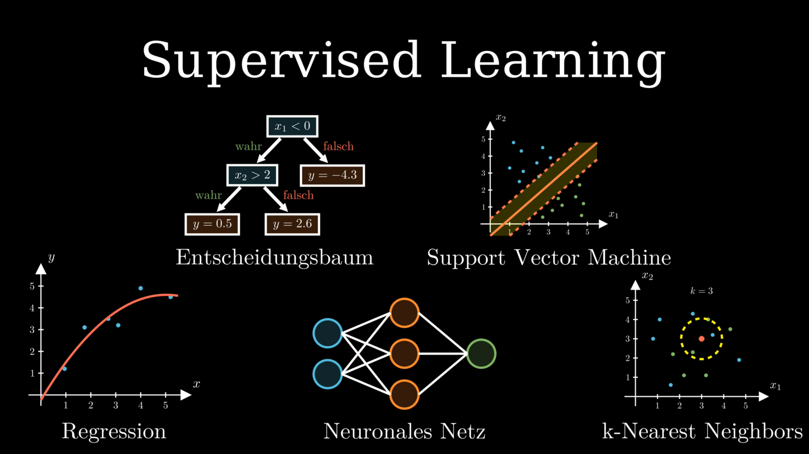

# Supervised Learning – Lernen mit gelabelten Daten

Beim **Supervised Learning** wird das Training des Modells mit **gelabelten** Daten durchgeführt. **Gelabelte** Daten sind Daten, die die zu prädizierende Größe enthalten. Möchte man also etwa Objekte im Straßenverkehr aus Bildern detektieren, so müssten die Daten, in diesem Falle die Bilder, mit denen das Modell trainiert wird, Informationen über die vorhandenen Objekte enthalten. Dies ist einmal beispielhaft auf dem Bild unter diesem Abschnitt zu sehen. In diesem Bild sind Autos, Lastwagen und Ampeln mit Rechtecken umrandet. Beim **Supervised Learning** wäre es nicht ausreichend, das Modell einfach nur mit Bildern aus dem Straßenverkehr zu trainieren, bei denen solche zusätzlichen Informationen über die Objekte fehlen.

## Supervised Learning Kategorien

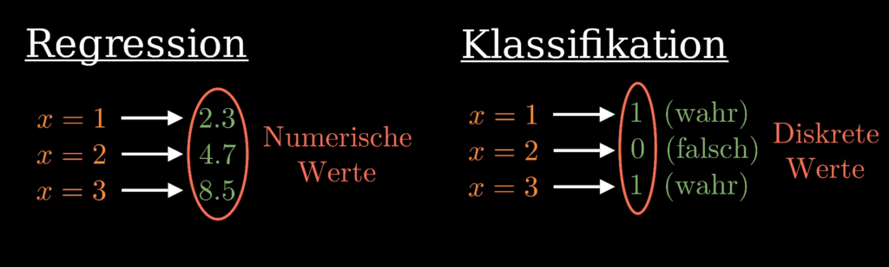

Im groben kann das **Supervised Learning** in die beiden Kategorien **Regression** und **Klassifikation** aufgeteilt werden. Bei der **Regression** werden die Input-Daten auf einen numerischen Wert abgebildet, d. h. es wird ein numerischer Wert durch das Machine Learning Modell prädiziert. So wird bei einem Input $`x = 1`$ etwa der Wert $`2.3`$ prädiziert, bei einem Input $`x = 2`$ der Wert $`4.7`$ und bei einem Input  der Wert $`8.5`$ usw. Das Häuserpreisbeispiel aus dem diesem Beitrag fällt zum Beispiel in diese Kategorie. Dort war die zu prädizierende Größe, nämlich die Preise der Häuser, ein numerischer Wert.

Im Gegensatz dazu werden bei der **Klassifikation** nur diskrete, meist ganzzahlige, Werte ausgegeben. Diese Werte sind meistens einer Kategorie zugeordnet, wie die $`1`$ und die $`0`$ den einfachen booleschen Werten wahr und falsch. Es können aber ganz beliebige Kategorien sein, wie Objekte im Straßenverkehr oder die Sprache eines Textes.

## Regression

Im Folgenden gehe ich auf einige Machine Learning Modelle ein, die bei der Regression zum Einsatz kommen.

### Lineare Regression

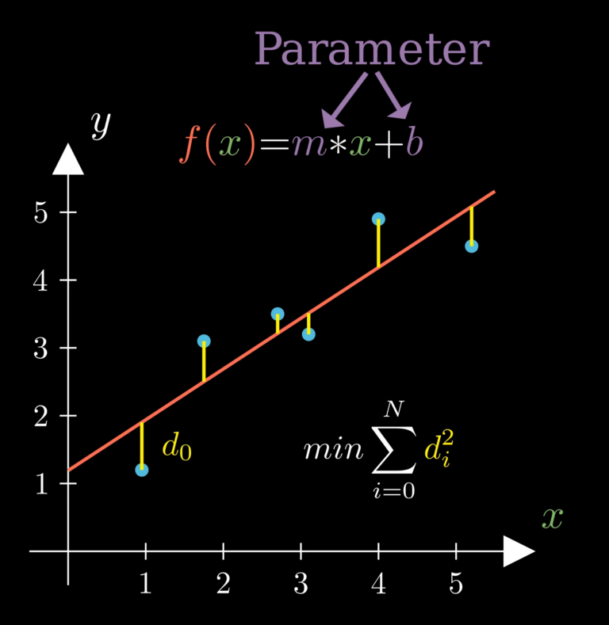

Das wohl einfachste Modell, das unter diese Kategorie fällt, ist die **lineare Regression**. Bei der **linearen Regression** wird eine lineare Funktion $`f(x) = mx + b`$ (rot) berechnet, die eine möglichst geringe Abweichung zu den einzelnen blauen Datenpunkten hat. Als Maß für den gelben Abstand $`d_i`$ wird vorwiegend die quadratische Abweichung zwischen Datenpunkt und Funktion gewählt. Die Summe dieser quadrierten Abstände $`d_i`$ wird durch Anpassung der Parameter $`m`$ und $`b`$ minimiert und somit die Funktion $`f(x)`$ bestimmt.

### Nicht lineare Regression

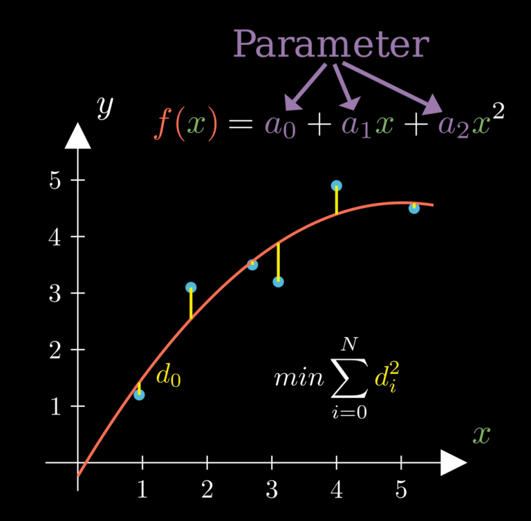

Den gleichen Ansatz verfolgt die **nicht lineare Regression**. Jedoch ist die Funktion $`f(x)`$ hier nicht linear und kann beliebige Funktionsterme und daher beliebig viele Parameter enthalten. In dem hier gezeigten Beispiel handelt es sich um ein quadratisches Polynom und dieses besitzt die drei Parameter $`a_0`$, $`a_1`$ und $`a_2`$. Diese drei Parameter werden so angepasst, dass die Summer der Abstände $`d_i`$ minimiert werden.

### Entscheidungsbaum

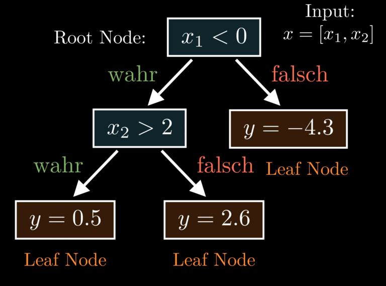

Eine ganz andere Idee steckt hinter dem **Entscheidungsbaum**, im Englischen **Decision Tree** genannt. Bei diesem Modell wird ein meist binärer Baum berechnet, der auf Basis der Daten verschiedene Verzweigungen bildet. Betrachten wir zunächst ein Beispiel, indem wir von einem zweidimensionalen Input $`(x_1, x_2)`$ ausgehen. Es wurde nun ein **Entscheidungsbaum** berechnet, der am obersten Punkt, auch als **Root Node** bezeichnet, überprüft, ob die Variable kleiner als $`0`$ ist. Trifft dies zu respektive ist diese Aussage wahr, so folgt der Baum dem linken Ast. 

Dort findet die nächste Prüfung statt, und zwar ob $`x_2`$ größer als $`2`$ ist. Ist die obere Aussage falsch, also $`x_1`$ ist größer gleich $`0`$ , so folgt der Baum dem rechten Ast und gibt den eindimensionalen Output $`y = -4.3`$ an. Gehen wir jetzt zurück zum linken Ast. Ist die Aussage $`x_2`$ größer als $`2`$ wahr, so wird als Output $`y = 0.5`$ ausgegeben. Ist die Aussage falsch, so wird $`y = 2.6`$ ausgegeben. 

Wird nun ein neuer Datenpunkt in den Baum eingespeist, so folgt er diesen einfachen Verzweigungen und gibt dann das entsprechende Ergebnis aus. Die Berechnung von **Entscheidungsbäumen** basiert auf einem **rekursiven Top-Down Prinzip**. Dabei werden die Daten anhand verschiedener Kriterien immer weiter von oben nach unten aufgesplittet. Diese Kriterien unterscheiden sich je nach Algorithmus und beinhalten etwa die Berechnung der kleinsten Entropie oder den maximalen Gewinn von Informationen.

### Random Forrest

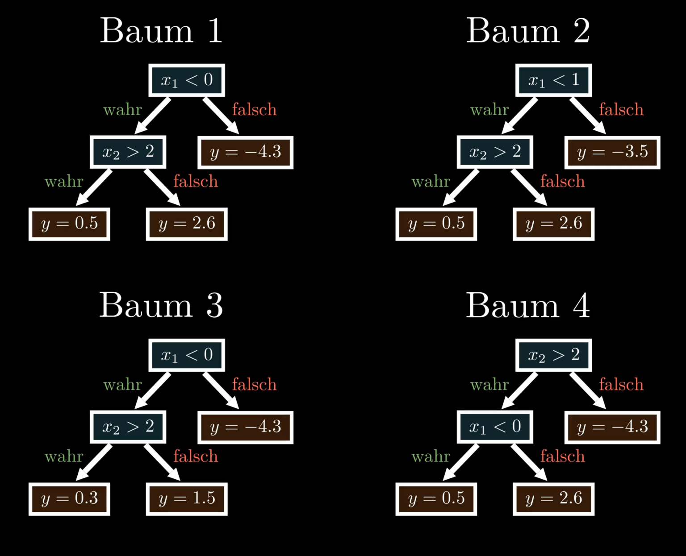

Das **Random Forrest** Modell verwendet nicht nur einen, sondern direkt eine Vielzahl von Entscheidungsbäumen. Der Output wird dann bestimmt durch alle Bäume, zum Beispiel, indem man einen Durchschnitt über die Ausgabe aller Bäume bildet. Damit die Bäume sich nach dem Training unterscheiden werden mittels **Bootstrap aggregating** bzw. **Bagging** verschiedene Trainingsdatensätze generiert. Beim **Bootstrap aggregating** werden zufällig Trainingsdatensätze mit $`n`$ Trainingsdaten erzeugt, wobei Datenpunkte auch mehrfach vorhanden sein dürfen. Das Training des **Random Forrest** Modell benötigt logischerweise länger als ein einzelner **Entscheidungsbaum**, wobei das Training der einzelnen Bäume hervorragend parallelisiert werden kann. Dafür neigt das Random **Forrest Modell** nicht so sehr zum Overfitting wie ein einzelner Entscheidungsbaum und zeigt in der Regel eine bessere Performance.

### Neuronales Netz

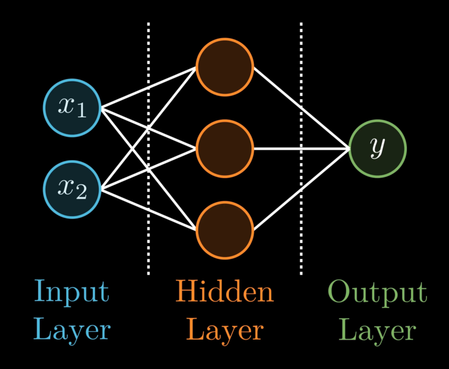

Ein **neuronales Netz** besteht aus mehrerer sogenannter Neuronen, hier als Kreise dargestellt. Die beiden blauen Neuronen links sind in diesem Beispiel der Input $`x_1`$ und $`x_2`$ des **neuronalen Netzes**. Man bezeichnet den linken Teil auch als **Input Layer**. Den folgenden mittleren Teil bezeichnet man als **Hidden Layer** und das Neuron ganz rechts als **Output Layer**. Wie der Name bereits sagt, wird hier der Output $`y`$ des **neuronalen Netzes** ausgegeben. 

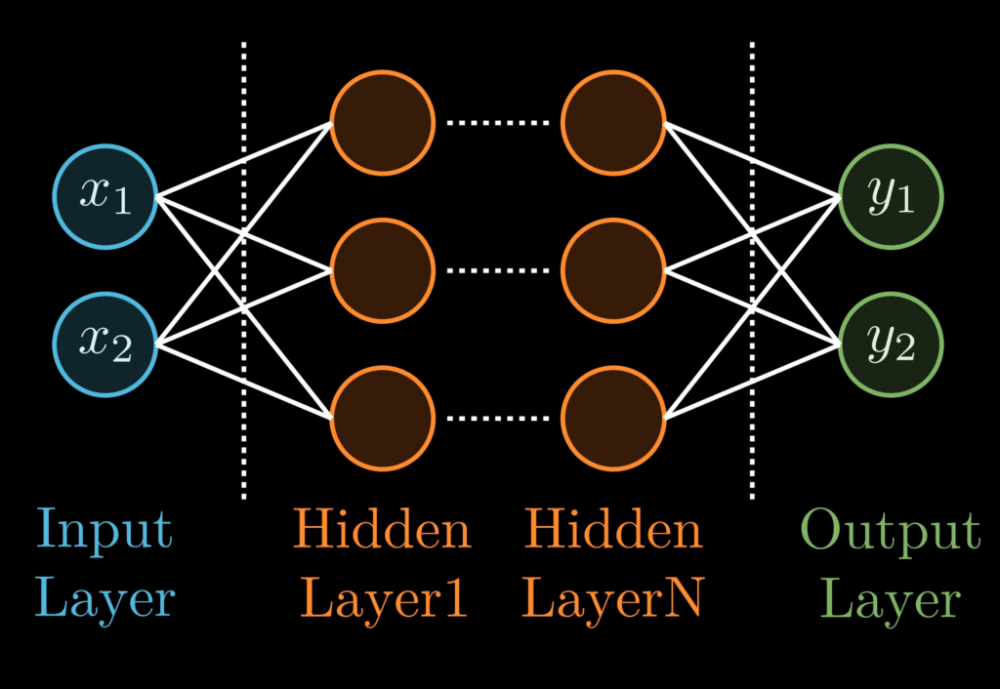

Ein **neuronales Netz** kann jedoch auch einen mehrdimensionalen Output erzeugen, wie oben im Bild durch den zweidimensionalen Output $`y_1`$ und $`y_2`$ gezeigt. Zudem können auch mehrere **Hidden Layer** unterschiedlicher Größe existieren, es gibt aber immer nur einen **Input** und einen **Output Layer**. Die Verbindungen zwischen den Neuronen zeigen den jeweiligen Input bzw. Output des Neurons an und können keine Layer überspringen. 

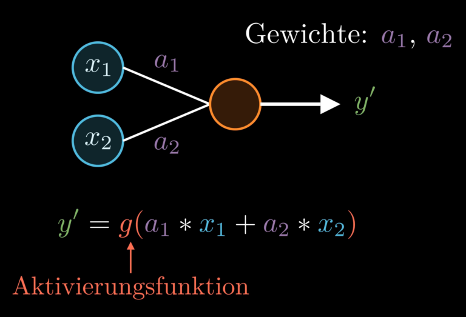

Der Input eines Neurons wird gewichtet und summiert. Die daraus resultierende Summe dient als Input für eine **Aktivierungsfunktion**, deren Ergebnis $`y´`$ dem Output des Neurons entspricht. Die Gewichte stellen die Parameter des Modells dar und werden vereinfacht gesagt so berechnet oder optimiert, dass die Datenpunkte aus den Trainingsdaten möglichst exakt bestimmt werden können. Zusätzlich wird meist noch ein Bias-Neuron eingebunden, das ich an dieser Stelle der Einfachheit halber weggelassen habe. Dieses Vorgehen wird für alle Neuronen, mit Ausnahme der Neuronen im **Input Layer**, durchgeführt und so der Output des **neuronalen Netzes** berechnet.

### Anwendungsbereiche

Es gibt natürlich noch viele weitere Modelle, die in diese Kategorie passen würden, insbesondere gibt es noch viele Varianten der hier bereits dargestellten Modelle. Für einen groben ersten Überblick sind diese Modelle meines Erachtens aber erst einmal ausreichend.

Anwendung finden **Regressionsmodelle** des **Supervised Learning** beispielsweise bei der **Prädiktion von Immobilienpreisen**, bei der **Vorhersage von Verkehrsflüssen** oder in Versicherungsgesellschaften zur **Bestimmung der Lebenserwartung eines Menschen**.

## Klassifikation

### Logistische Regression

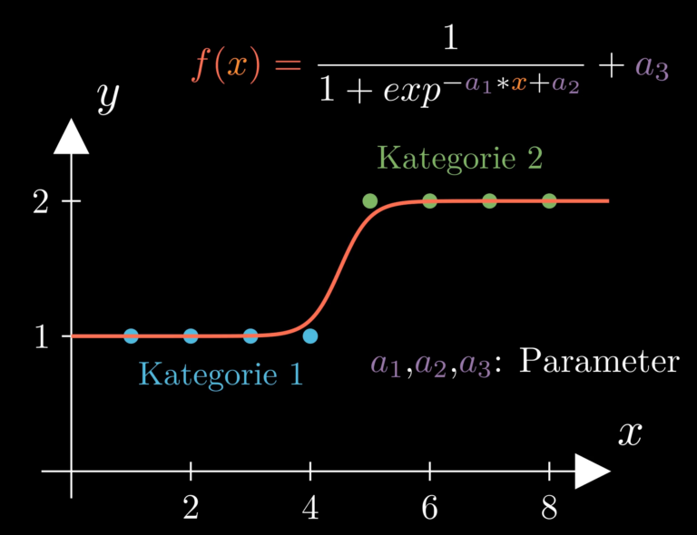

Das erste Modell, das ich hier vorstelle, ist die **logistische Regression**. Die **logistische Regression** ist eine Variante der beiden bereits vorgestellten Regressionsmodelle. Betrachten wir an dieser Stelle mehrere Datenpunkte, die den beiden Kategorien 1 oder 2 zugeordnet sind. Kategorie 1 erhält den fiktiven Wert $`y = 1`$ und Kategorie 2 den fiktiven Wert $`y = 2`$. Es wird nun erneut eine Funktion gesucht, die die Punkte möglichst exakt abbildet wie die rote Funktion im obigen Bild. Die Funktion

f(x)

ist Grundlage der **logistischen Regression** bei skalarem Input $`x`$. Die Parameter $`a_1`$, $`a_2`$ und $`a_3`$ werden entsprechend optimiert, um die Datenpunkte möglichst exakt abzubilden. 

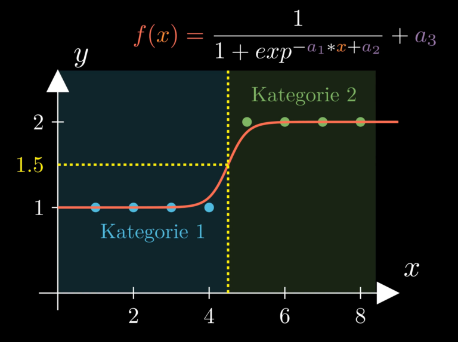

Möchte man jetzt Werte mit der Funktion $`f(x)`$ auswerten, so weißt man allen Daten mit x-Werten, deren Funktionswert kleiner als $`1.5`$ ist, der linken blau eingefärbten Seite und damit Kategorie 1 zu. Allen anderen x-Werte, die einen Funktionswert größer als $`1.5`$ haben, werden Kategorie 2 zugewiesen. Der Wert $`1.5`$ ist dabei nicht festgelegt, sondern kann in diesem Beispiel einen beliebigen Wert im Intervall $`[1,2]`$ annehmen, je nachdem wie man das Modell einstellen möchte. Bei einem Wert von $`1.7`$ verschieben sich bspw. die Bereiche wie im unteren Bild dargestellt.

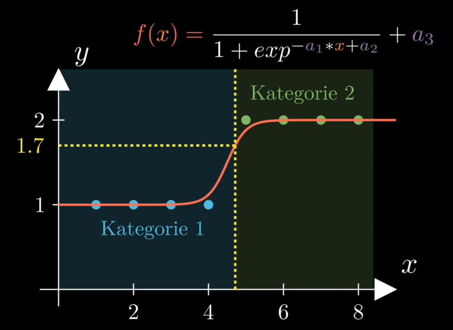

### Support Vector Machine

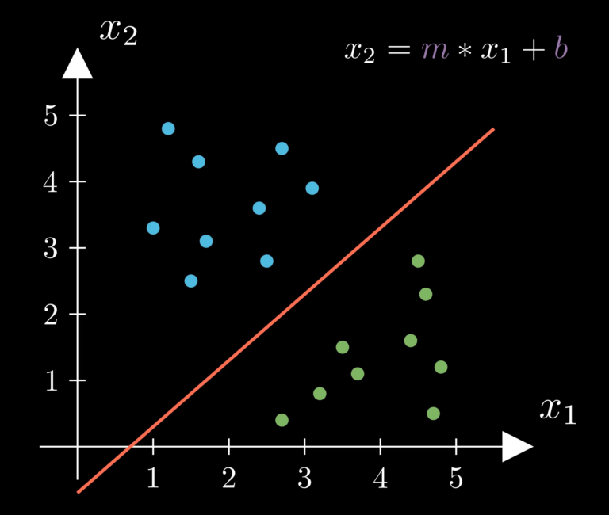

Ein weiteres interessantes Modell ist die **Support Vector Machine** abgekürzt **SVM**. Betrachten wir die zweidimensionalen Datenpunkte in obiger Abbildung, die ihrer Farbe entsprechend wieder zwei Kategorien zugeordnet sind. Das **SVM-Modell** sucht nun eine sogenannte Hyperebene, die die Daten voneinander trennt. Eine Hyperebene ist ein geometrisches Objekt, welches eine Dimension weniger besitzt als der Raum, indem sie liegt. So ist eine Hyperebene in diesem zweidimensionalen Beispiel eine Gerade $`x_2 = mx_1 + b`$, in einem kubischen Raum wäre die Hyperebene eine Fläche usw. Theoretisch gibt es in diesem Beispiel unendlich viele Möglichkeiten mittels einer Gerade die beiden Punktewolken voneinander zu trennen.  

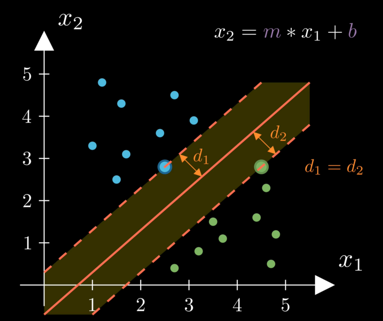

Das Besondere an der **SVM** ist jetzt, dass die beiden Parameter $`m`$ und $`b`$ so berechnet werden, dass die Gerade den größtmöglichen Abstand von den Datenpunkten einhält. Die beiden hervorgehobenen Datenpunkte liegen jeweils am nächsten zu der berechneten Geraden. Im gelb eingezeichneten Zwischenraum der beiden gestrichelten Parallelen befinden sich keine weiteren Datenpunkte und der Abstand $`d_1`$ und $`d_2`$ zwischen den Geraden ist gleich groß. Somit hat die eingezeichnete Gerade den größtmöglichen Abstand zu allen Datenpunkten, während sie die Datenpunkte beider Kategorien eindeutig voneinander trennt. Für nicht lineare Hyperebenen und Ausreißerwerte gibt es spezielle Formen der **SVM**.

### Naive Bayes classifier

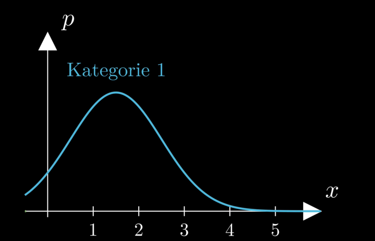

Das nächste Modell, das ich vorstellen möchte, basiert auf Wahrscheinlichkeitsverteilungen und nennt sich **Naive Bayes classifier**. Bei diesem Modell wird eine Wahrscheinlichkeitsverteilung für die Datenpunkte einer Kategorie berechnet, wie die hier dargestellte Gaußsche Wahrscheinlichkeitsverteilung für Kategorie 1. Die entsprechende Formel lautet:

f(x)

Dabei steht $`K_k`$ für die k-te Kategorie. Als Parameter stehen in der gaußschen Wahrscheinlichkeitsverteilung die **Standardabweichung** $`\sigma_k`$ und der **Erwartungswert** $`\mu_k`$ zur Verfügung, die so berechnet werden, dass die Datenpunkte möglichst exakt abgebildet werden können. 

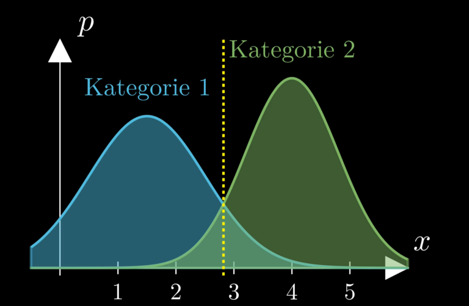

Die Berechnungen werden für alle Kategorien durchgeführt, wie hier für die zweite Kategorie, die etwa eine geringere **Standardabweichung** als die erste Kategorie hat. Wird nun ein Datenpunkt mit einem bestimmten x-Wert ausgewertet, so kann die Wahrscheinlichkeit mit der obigen Formel für jede Kategorie bestimmt werden. Generell ordnet man anschließend den Datenpunkt der Kategorie mit der höchsten Wahrscheinlichkeit zu. Statt einer gaußschen Wahrscheinlichkeitsverteilung lassen sich für dieses Modell auch andere beliebige Wahrscheinlichkeitsverteilungen verwenden.

### k-Nearest Neighbors

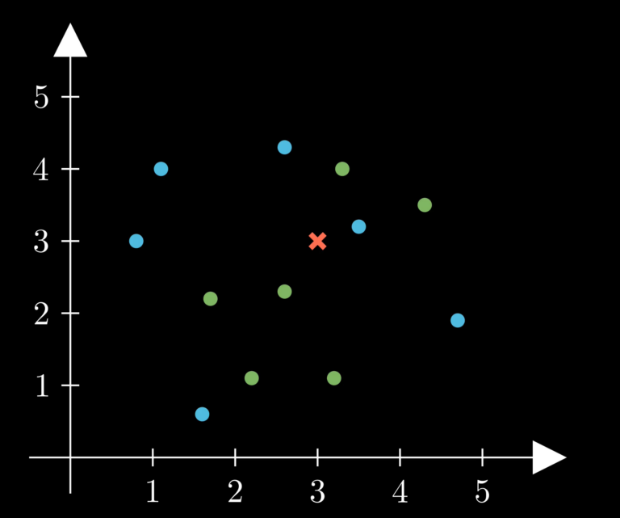

Ein weiteres recht bekanntes und vergleichsweise einfaches Modell ist **k-Nearest Neighbors**, abgekürzt **KNN**. Betrachten wir die Verteilung der Datenpunkte der grünen und blauen Kategorie auf der rechten Seite der obigen Abbildung, sowie des roten Kreuzes, den wir einer der beiden Kategorien zuordnen wollen. Soll nun eine Kategorie für einen neuen Datenpunkt bestimmt, genauer gesagt prädiziert werden, so werden die $`k`$ nächsten Nachbarn des Punktes bestimmt. Je nachdem welche Kategorie innerhalb dieser $`k`$ nächsten Nachbarn öfter auftritt, wird dem Datenpunkt diese zugeordnet. 

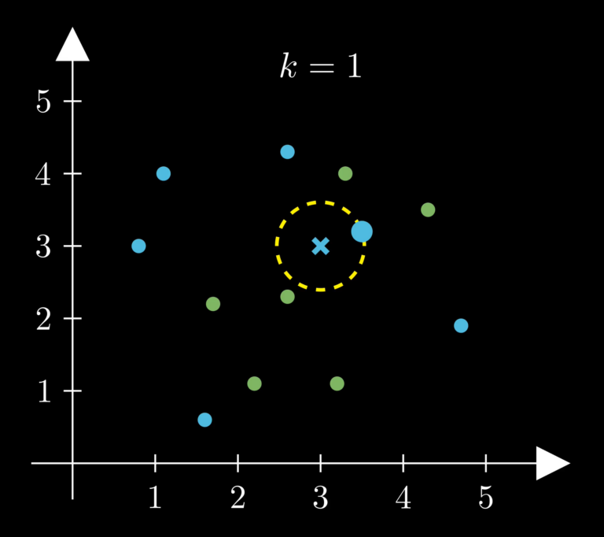

Bei $`k = 1`$ wird zum Beispiel nur der nächstliegende Datenpunkt betrachtet, was in diesem Fall der blaue Datenpunkt ist. Somit wird dem roten Kreuz die blaue Kategorie zugeordnet. 

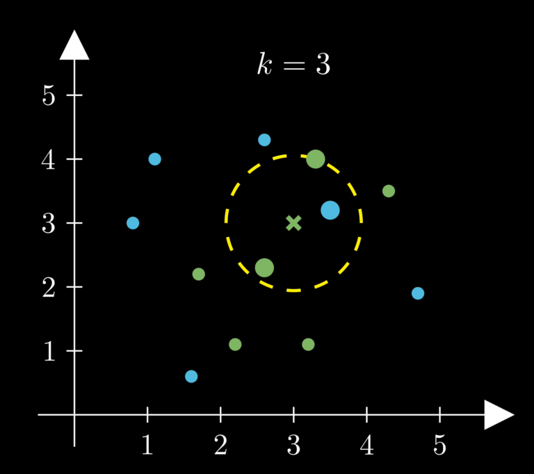

Bei $`k = 3`$ werden die drei nächsten Nachbarn betrachtet. Da zwei grüne Datenpunkte nun ebenfalls betrachtet werden, wird dem Kreuz die grüne Kategorie zugeordnet.

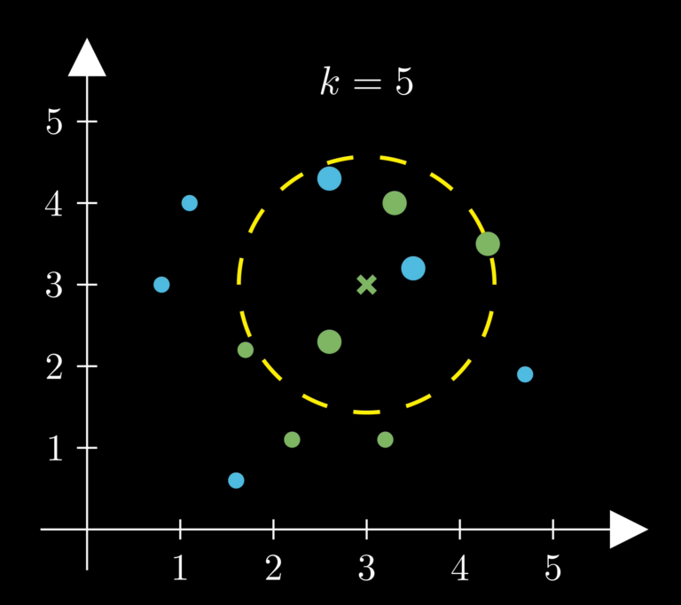

Bei $`k = 5`$ kommen je ein grüner und ein blauer Datenpunkt hinzu. Damit ist die grüne Kategorie weiterhin in der Überzahl und das Kreuz wird weiterhin der grünen Kategorie zugeordnet. 

Das **kNN-Modell** kann auch für eine **Regression** verwendet werden. Dann werden einfach die Werte der nächstliegenden Datenpunkte gemittelt und so der Wert für den neuen Datenpunkt ermittelt. Weiterhin ist es möglich, die Datenpunkte aufgrund ihrer Entfernung unterschiedlich zu gewichten, sodass näher liegende Datenpunkte einen höheren Einfluss haben.

### Entscheidungsbaum und Random Forrest

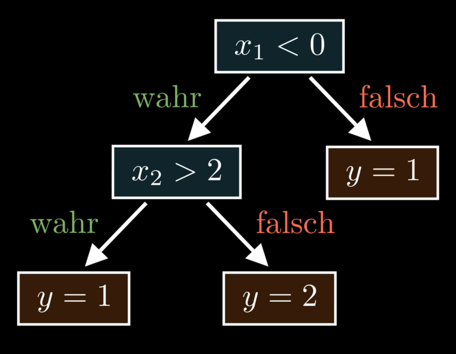

Ebenfalls zur Klassifikation können **Entscheidungsbäume** und deren Erweiterung **Random Forrest** verwendet werden. Statt numerischer Werte werden jedoch diskrete Werte ermittelt und jeweils einer Kategorie zugeordnet. In diesem Beispiel gibt es die Kategorien $`y = 1`$ und $`y = 2`$. Beim **Random Forrest** Modell wird dann die Kategorie gewählt, die von der Mehrheit der **Entscheidungsbäume** prädiziert wurde.

### Neuronales Netz

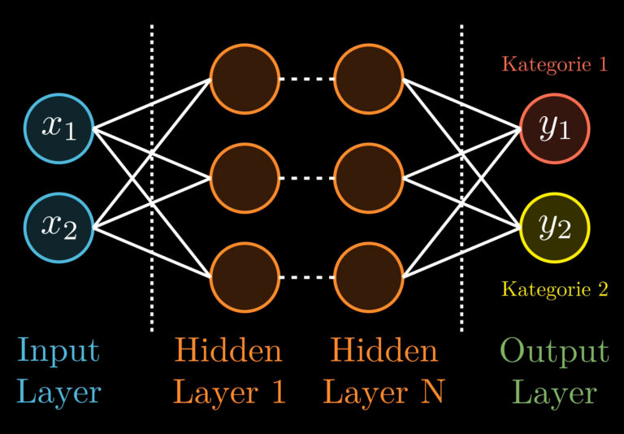

Auch ein **neuronales Netz** kann zur Kategorisierung verwendet werden. Dazu wird den Neuronen im Output Layer jeweils eine Kategorie zugeordnet. Beim Training des Modells erhält die korrekte Kategorie den Wert 1 und alle anderen Kategorien den Wert 0. Wird nun ein neuer Datenpunkt prädiziert, so kann anhand der Werte aus dem **Output Layer** ermittelt werden, um welche Kategorie es sich handelt. 

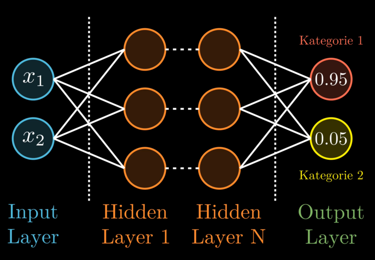

Hier wurde durch das **neuronale Netz** eine hohe Wahrscheinlichkeit für die erste und eine niedrige Wahrscheinlichkeit für die zweite Kategorie berechnet.

### Anwendungsbereich

Auch für die Klassifikation gibt es noch viele weitere und noch einige Varianten der hier bereits vorgestellten Modelle. Blicken wir aber jetzt einmal auf den Anwendungsbereich der **Klassifikation**. Dazu gehört etwa die **Objektdetektion**, die ich bereits am Anfang des Videos kurz gezeigt hatte. Aber auch in der Medizin, zum Beispiel zur **Erkennung von Tumoren**, können die hier vorgestellten Modelle eingesetzt werden. Ein Punkt, dem die meisten von uns im Alltag wohl begegnen, ist das **Generieren von Empfehlungen** auf Basis des Nutzerverhaltens. Sei es bei Netflix oder YouTube. Viele Algorithmen, die uns Filme, Bücher oder andere Medien oder Artikel vorschlagen, basieren auf einem oder mehrere der hier gezeigten Modelle. Natürlich gibt es noch viele weitere Möglichkeiten und Anwendungsbereiche.

## Zusammenfassung Supervised Learning

**Supervised Learning** ist ein Ansatz des maschinellen Lernens, bei dem ein Algorithmus aus Daten lernt, die bereits mit den entsprechenden Labels versehen sind. Das bedeutet, dass der Algorithmus bereits weiß, welche Ausgabe er für eine bestimmte Eingabe erwartet. Im Artikel werden verschiedene Modelle des **Supervised Learnings** vorgestellt, wie die **lineare Regression** oder **Entscheidungsbäume**. Je nach Anwendung kann es sinnvoll sein, verschiedene Modelle auszuprobieren und zu vergleichen, um das beste Ergebnis zu erzielen.

Ein weiterer wichtiger Aspekt des **Supervised Learnings** ist die Qualität der Daten. Die Daten müssen in der Regel bereinigt und vorbereitet werden, bevor sie in das Modell eingespeist werden können. Es ist auch wichtig, genügend Daten zu haben, um ein zuverlässiges Modell zu trainieren. Weitere Informationen dazu findest du in diesem Beitrag. Insgesamt ist **Supervised Learning** ein wichtiger Ansatz des maschinellen Lernens, der in vielen Anwendungen eingesetzt wird. Es ermöglicht es, Vorhersagen auf der Grundlage von Daten zu treffen und kann dazu beitragen, Prozesse zu automatisieren und zu optimieren.

## Quellen

[https://medium.com/ml-research-lab/machine-learning-algorithm-overview-5816a2e6303](https://medium.com/ml-research-lab/machine-learning-algorithm-overview-5816a2e6303)

[https://machinelearningmastery.com/a-tour-of-machine-learning-algorithms/](https://machinelearningmastery.com/a-tour-of-machine-learning-algorithms/)

[https://machinelearningmastery.com/master-machine-learning-algorithms/](https://machinelearningmastery.com/master-machine-learning-algorithms/)
