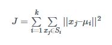
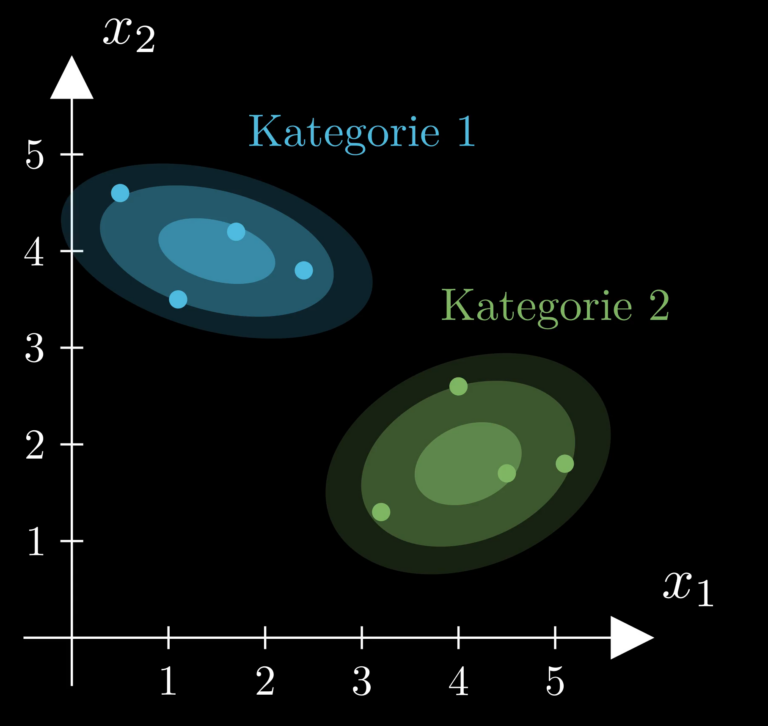
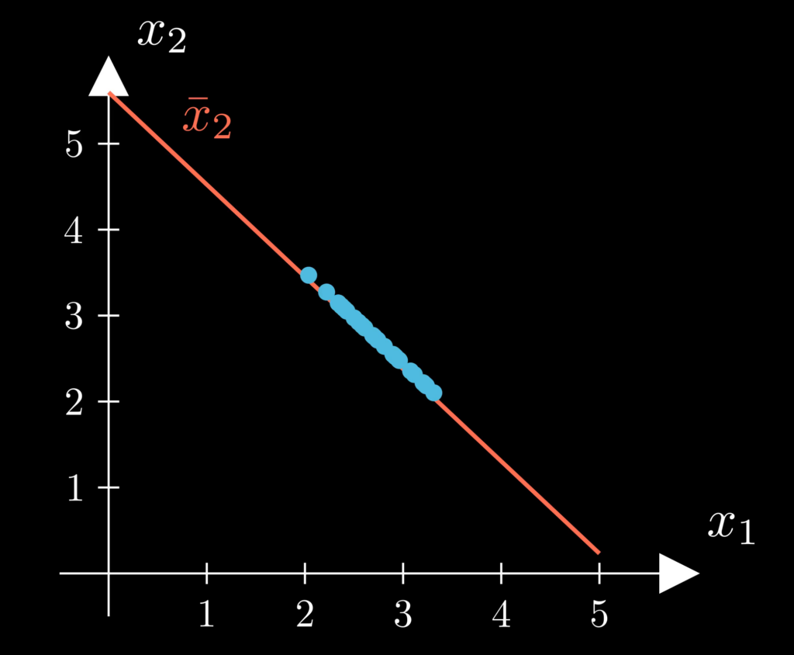

# Unsupervised Learning – Ein Überblick über Modelle und Anwendungen

**Unsupervised Learning**, im Deutschen auch als **unüberwachtes Lernen** bekannt, ist eine Methode des maschinellen Lernens, bei der ein Algorithmus Muster und Strukturen in Daten erkennt, ohne dass diese zuvor gelabelt oder kategorisiert wurden. Im Gegensatz zum **Supervised Learning** aus dem vorigen Artikel, bei dem ein Modell auf der Grundlage von gelabelten Daten trainiert wird, hat **Unsupervised Learning** das Potenzial, wichtige Erkenntnisse aus unstrukturierten Daten zu gewinnen. Somit können neue Einblicke in komplexe Probleme gewonnen werden.

**Unüberwachtes Lernen** hat in den vergangenen Jahren aufgrund der zunehmenden Verfügbarkeit großer Datenmengen und der Fortschritte in der Rechenleistung an Bedeutung gewonnen. In diesem Artikel werde ich mich näher mit den verschiedenen Modellen des **Unsupervised Learning** befassen und auch auf verschiedene Anwendungsmöglichkeiten zu sprechen kommen.

## Unsupervised Learning Kategorien

Wie auch das Supervised Learning kann das Unsupervised Learning grob in zwei Bereiche eingeteilt werden: das **Clustern** und die **Dimensionsreduktion**.

Beim **Clustern** werden die Datenpunkte zu mehreren Kategorien zusammengefasst. Diese Kategorien werden auf Basis verschiedener Kriterien ermittelt, sodass die Datenpunkte innerhalb einer Kategorie einander möglichst ähnlich sind.

Im Gegensatz dazu wird bei der **Dimensionsreduktion**, wie der Name bereits sagt, versucht, die Dimension der Datenpunkte zu reduzieren. Dies geschieht jedoch nicht einfach dadurch, dass man eine Dimension gewissermaßen weglässt, sondern es werden, je nach Modell, verschiedene Ziele verfolgt. So kann eines dieser Ziele sein, den Verlust an Informationen möglichst gering zu halten.

## Clustern

Blicken wir nun zunächst einmal auf einige Modelle, die dem **Clusterbereich** zugeordnet werden.

### k-Means

Ich beginne diesen Artikel mit dem relativ weitverbreiteten Modell **k-Means**. Beginnen wir mit einem Satz von blauen Datenpunkten, wie die auf der obigen linken Abbildung. Die Variable $`k`$ bezeichnet in diesem Modell die Anzahl der Cluster, die gebildet werden sollen und muss vor dem Training des Modells festgelegt werden. Ich wähle jetzt einmal $`k = 3`$, womit es drei Cluster und damit auch drei Clusterzentren $`\mu`$ gibt. Die einzelnen Datenpunkte werden dem Clusterzentrum zugeordnet, zu dem sie räumlich gesehen am nächsten liegen, wie in der rechten Abbildung oben dargestellt. Diese drei Clusterzentren sind die Parameter des Modells und werden durch das Modell so lange iterativ angepasst, bis die folgende Kostenfunktion $`J`$ minimiert wurde:

Beachtet, dass Datenpunkte nicht fix einem Clusterzentrum zugeordnet sind, sondern sich die Zuordnung durch die Veränderung der Clusterzentren ebenfalls immer wieder verändert. Die Kostenfunktion setzt sich aus den quadrierten euklidischen Distanzen der zugeordneten Datenpunkte $`x_j`$ von ihrem jeweiligen Clusterzentrum $`\mu_i`$ summiert über alle Datenpunkte und Cluster zusammen. Die Mengen aus Datenpunkten, die einem Clusterzentrum $`\mu_i`$ zugehörig sind, werden als $`S_i`$ bezeichnet. 

Verändert man die Anzahl der Clusterzentren zum Beispiel auf zwei, so werden die Datenpunkte entsprechend nun zwei Clusterzentren zugeordnet. Gleiches gilt für den Fall $`k = 4`$, also vier Clusterzentren. Durch die Verwendung des quadrierten euklidischen Abstandes kann man sich bildlich Kreise um die Clusterzentren vorstellen, die die Zugehörigkeiten der einzelnen Punkte darstellen, siehe untere Abbildung. 

Wie man an diesem Beispiel bereits sehen kann, ist es nicht immer unbedingt einfach, die korrekte Anzahl an Clustern zu ermitteln. In der Praxis werden oft einfach unterschiedliche Werte getestet und die Ergebnisse anschließend miteinander verglichen.

### Gaussian Mixture Model

Das nächste Modell ist das **Gaussian Mixture Model**, welches von der Grundidee her stark an den **Naive Bayes classifier** aus meinem Supervised Learning Artikel erinnert. Betrachten wir zunächst einen eindimensionalen Fall mit mehreren Datenpunkten auf der x-Achse, wie in der obigen Abbildung. Beim **Gaussian Mixture Model** werden Gaußsche Wahrscheinlichkeitsverteilungen auf Basis der Datenpunkte berechnet:

Dabei bilden die Standardabweichung $`\sigma`$ und der Erwartungswert $`\mu`$ für jede Kategorie $`k`$ erneut die Parameter, die durch das Modell optimiert werden. Beachtet, dass im Gegensatz zum **Naive Bayes classifier** die Daten zuvor keiner Kategorie zugeordnet waren. Im Vergleich zum **k-Means** Modell können beim **Gaussian Mixture Model** Wahrscheinlichkeiten für die Zuordnung zu einer Kategorie bestimmt werden. Beim **k-Means** Modell wurden Datenpunkte dagegen immer fest einer einzelnen Kategorie zugeordnet. Die Berechnung hinter dem **Gaussian Mixture Model** sind allerdings auch deutlich komplexer, daher verzichte in an dieser Stelle auf weitere Ausführungen. 

Für den zweidimensionalen Fall bilden sich beim **Gaussian Mixture Model** Ellipsen aus, die deutlich anpassungsfähiger sind als die Kreise, die sich beim **k-Means** Modell herausbilden. Dieser Vorteil zeigt sich auch in höheren Dimensionen.

### DBScan

Beim **DBScan**-Modell ist besonders interessant, dass die Anzahl der Cluster zuvor nicht bekannt sein muss, sondern dass sich die Anzahl der Cluster während des Trainings automatisch ergeben. **DBScan** steht für „Density-Based Spatial Clustering of Applications with Noise“, was man ins Deutsche in etwa mit „Dichtebasierte räumliche Clusteranalyse mit Rauschen“ übersetzen kann. 

Betrachten wir nun einmal den kleinen Satz an Datenpunkten in der linken obigen Abbildung. Doch bevor das Training des Modells beginnt, müssen zunächst die beiden Parameter $`\epsilon`$ und $`n`$ festgelegt werden. Ich wähle für dieses Beispiel $`\epsilon = 1.0`$ und $`n = 3`$. Der Algorithmus bestimmt beim Training sogenannte Kernpunkte, wie in rechten obigen Abbildung in Blau dargestellt. Diese Kernpunkte erfüllen die Eigenschaft, dass sich im Abstand $`\epsilon`$ , mindestens $`n`$, also drei, Datenpunkte befinden. Der Datenpunkt selbst gehört hier mit dazu, das heißt es müssen sich noch zwei zusätzliche Punkte innerhalb des gestrichelten Kreises befinden. 

Weiterhin gibt es sogenannte dichte-erreichbare Punkte, oben in Grün dargestellt. Das sind Punkte, bei denen sich nicht die erforderliche Anzahl an anderen Datenpunkten im Abstand $`\epsilon`$ zu diesem Punkt befinden, aber es mindestens einen Kernpunkt im Abstand $`\epsilon`$ gibt. Alle anderen Punkte, die diesen Eigenschaften nicht erfüllen, werden als Rauschen beziehungsweise Rauschpunkte klassifiziert, wie die beiden oberen roten Punkte. 

Betrachten wir nun ein etwas größeres Beispiel und ändern zusätzlich die Parameter des Models auf $`\epsilon = 0.5`$ und $`n = 5`$. Die hellgrünen, hellblauen und rosa Punkte sind jeweils Kernpunkte eines eigenen Clusters. Im Gegensatz zum vorigen Beispiel gibt es also drei Cluster statt nur einem. Die dunkleren Farben stellen die jeweiligen dichte-erreichbaren Punkte dar, die sich wenig überraschend meist am Rand der Cluster finden. Die übrigen Rauschpunkte sind erneut in Rot dargestellt.

### Anwendungsbereiche

Anwendung finden **Clustermodelle** beispielsweise bei der **Generierung von Empfehlungen**, etwa von Filmen oder Produkten. In meinem letzten Artikel zum Thema **Supervised Learning**, hatte ich bereits gesagt, dass auch **Supervised Learning** Modelle dafür verwendet werden können. Dazu werden jedoch genauere Daten über den User benötigt, um das Modell entsprechend trainieren zu können. Bei Verwendung eines **Clustermodells** werden dem User einfach ähnliche Filme oder Produkte empfohlen, die er bereits gesehen oder gekauft hat. Wer sich also wundert, warum er dauernd eine neue Couch empfohlen bekommt, obwohl er doch gerade erst eine neue gekauft hat, dann ist es möglich, dass sich hinter dieser Empfehlung ein solches **Clustermodell** befindet. 

Weitere Möglichkeiten zur Anwendung dieser Modelle bestehen in der **Kunden- und Marktsegmentierung**. So können Kunden mit ähnlichem Kaufverhalten zu Gruppen zusammengefasst und entsprechende Werbungen geschaltet werden. Viele weitere Möglichkeiten zeigen sich auch in der **Biologie** und **Medizin**. So können etwa Daten von Personen, die an Krebs leiden und solche, die es glücklicherweise nicht tun, in ein solches Modell eingespeist werden. So lassen sich möglicherweise Zusammenhänge zwischen den gesunden und den an Krebs leidenden Personen erkennen. Es gibt auch noch viele weitere Anwendungsmöglichkeiten und vermutlich auch viele, die erst entdeckt werden wollen, kommen wir aber nun zum Thema **Dimensionsreduktion**.

## Dimensionsreduktion

### Principal Component Analysis

Ich stelle hier zunächst das recht bekannte **Modell Principal Component Analysis**, abgekürzt **PCA** oder zu Deutsch **Hauptkomponentenanalyse**, vor. Das mathematische Verfahren hinter der **PCA** ist **Singular Value Decomposition**, abgekürzt **SVD** oder zu Deutsch **Singulärwertzerlegung**. Hierbei werden durch Verwendung von Eigenwerten und Eigenvektoren der Kovarianzmatrix der Daten eine neue orthonormale Basis berechnet. Die Datenpunkte können dann von der ursprünglichen Basis in die neue Basis transformiert werden. 

Die ursprüngliche Basis ist das oben gezeigte Koordinatensystem. Der erste Vektor bzw. die erste Komponente wird so bestimmt, dass sie den quadratischen Abstand aller Punkte zu diesem Vektor bzw. zur gedachten Verlängerung des Vektors minimiert. Für die hier gezeigten Datenpunkte entspricht das dem grünen Vektor bzw. der grünen Geraden. Betrachten wir aber zunächst nur die erste Komponente und ziehen eine durchgehende Gerade entlang des Vektors und bezeichnen diese Dimension der neuen Basis als $`\overline{x}_1`$
, siehe rechte Abbildung oben.

Nun kann man die Dimension der Daten reduzieren, indem man die Datenpunkte auf diese neue Basis transformiert. Oder einfach gesagt, man schiebt die Punkte orthogonal auf die neue Gerade $`\overline{x}_1`$
, siehe obige Abbildung.

Da es sich um zweidimensionale Datenpunkte handelt, können insgesamt auch zwei Komponenten bestimmt werden. Die eben gezeigte Transformation auch für die zweite Komponente möglich, aber nicht besonders sinnvoll. Dazu werden die Datenpunkte auf die Gerade $`\overline{x}_2`$
transformiert, siehe die beiden obigen Abbildungen.

Vergleichen wir jetzt die Transformationen miteinander in der obigen Abbildung, dann können wir darin die Funktionsweise und den Sinn der **PCA** erkennen. Bei der Transformation auf die Gerade $`\overline{x}_2`$
sind die Punkte sehr dicht beieinander. Das bedeutet vereinfacht gesagt, dass viele Informationen in den Datenpunkten verloren gehen, da diese jetzt deutlich enger zusammenhängen und schwieriger auseinanderzuhalten sind. Im Gegensatz dazu wurden bei der Transformation auf die Gerade $`\overline{x}_1`$
möglichst viele Informationen erhalten. Die Datenpunkte liegen deutlich weiter auseinander. 

Allgemein gesprochen ist die erste Hauptkomponente immer die, die am meisten Informationen erhält bzw. die, die die Datenpunkte am wenigsten verändert. Die zweite Hauptkomponente ist die Komponente, die am zweitmeisten Informationen erhält, usw. Wird nun ein Datensatz von 100 auf 10 Dimensionen mittels **PCA** reduziert, so wird zwar die Anzahl der Dimensionen um 90% reduziert, aber es gehen damit deutlich weniger als 90% der Informationen in den Daten verloren.

### Locally Linear Embedding

Einen anderen Ansatz verfolgt das **Locally Linear Embedding** Modell, abgekürzt **LLE**. Zwar versucht die **PCA** den Datenverlust zu minimieren, jedoch werden durch die Transformation häufig Punkte sehr nah aneinander geschoben, die zuvor räumlich relativ weit auseinanderlagen. Das **LLE** Modell ist im Gegensatz dazu bestrebt, den zuvor existierenden Abstand zwischen den einzelnen Punkten möglichst genau in der Transformation wiederzugeben. 

Betrachten wir dazu die Datenpunkte in der linken oberen Abbildung und im speziellen einmal den Punkt $`X_i`$. Ähnlich wie beim **k-Nearest Neighbors** Modell werden die $`k`$ nächsten Nachbarn des Punktes betrachtet. Für $`k = 3`$ ist das einmal in der rechten oberen Abbildung dargestellt. Vom Punkt $`X_i`$ wird nun die Summe dieser Punkte abgezogen, wobei diese zusätzlich noch mit einer Gewichtung $`W_ij`$ multipliziert werden. Über diese Differenz wird die 2-Norm gebildet. Dieser Schritt wird für alle Datenpunkte wiederholt und entsprechend aufaddiert. Diese Berechnung bezeichnen wir als die Funktion $`c(W)`$ , das heißt die Gewichte $`W`$ sind die Variablen in der Funktion $`c(W)`$, die minimiert werden soll:

Das Minimieren der Funktion $`c(W)`$ sagt letztlich Folgendes aus: Die Gewichte $`W`$ werden so angepasst, dass diese möglichst exakt alle Punkt $`X_i`$ aus einer Linearkombination der Gewichte $`W`$ und den Punkten $`X_j`$ wiedergeben können. Im zweidimensionalen Fall wäre diese Linearkombination sogar mit zwei Punkten $`X_j`$ möglich, aber wir stellen uns an dieser Stelle einmal eine deutlich höhere Dimension der Datenpunkte vor. Jetzt folgt die Transformation in diesem Modell. Die Datenpunkte $`X_i`$ werden auf die Datenpunkte $`Y_i`$ transformiert, wobei $`Y_i`$ eine niedrigere Dimension als $`X_i`$ hat. Zum Beispiel kann $`Y_i`$ zweidimensional sein, um möglichst einfach höherdimensionale Datenpunkte $`X_i`$ visualisieren zu können. Die Transformation wird über die Minimierung der obigen Gleichung $`\phi(Y)`$ bestimmt: 

An dieser Stelle sind die berechneten Gewichte $`W`$ aus der vorigen Gleichung fest vorgegeben, also konstant und die Datenpunkte $`Y`$ werden so lange angepasst, bis diese Gleichung minimiert wird. In den unteren Abbildungen ist die Transformation einmal dargestellt, wobei man sich vorstellen muss, dass die Dimension der $`Y`$-Datenpunkte kleiner ist als die Dimension der $`X`$-Datenpunkte.

Um euch ein besseres Gefühl dafür zu geben, wie diese Transformation tatsächlich vonstattengeht, schauen wir uns das folgende Beispiel einmal an. Wir haben Datenpunkte in S-Form gegeben. Um die einzelnen Datenpunkte im Folgenden besser auseinanderhalten zu können, sind diese entsprechend eingefärbt. Ich führe eine Transformation mittels des **LLE** Modells durch, siehe die Abbildung unten rechts. Wie man sehen kann, sind die Punkte, die zuvor nah aneinander lagen, auch nach der Transformation räumlich gesehen noch ziemlich dicht beieinander. Die Transformation gibt an dieser Stelle nicht den exakten Farbverlauf wieder, hier ließe sich durch Anpassung der Parameter oder eventuell auch durch eine größere Menge an Datenpunkten das Ergebnis womöglich noch verbessern.

### Weitere Modelle zur Dimensionsreduktion

Insgesamt repräsentieren die beiden gezeigten Modelle die beiden wichtigsten Gruppen an Modellen, die zur **Dimensionsreduktion** eingesetzt werden. Es existieren noch einige Varianten der beiden gezeigten Modelle. Unter anderem **Non-Negative Matrix Factorization** oder **Spectral Embedding**. Zusätzlich gibt es auch noch das **Linear Discriminant Analysis** Modell, welches keine Variante der beiden gezeigten Modelle darstellt und ebenfalls zur **Dimensionsreduktion** eingesetzt werden kann. Jedoch benötigt man für dieses Modell gelabelte Daten, womit es eigentlich zu den **Supervised Learning** Modellen zählt. Daher habe ich es an dieser Stelle ausgelassen.

### Anwendungsbereiche

Angewendet werden diese Modelle häufig, wie eben bereits erwähnt, zur **Visualisierung von Daten**. Daten mit mehr als drei Dimensionen lassen sich nun einmal nicht wirklich gut darstellen und daher werden diese Modelle entsprechend eingesetzt. Hilfreich kann die **Dimensionsreduktion** auch sein, um den Dimensionsinput für andere Machine Learning Modelle zu reduzieren. Dieser Schritt wird dann innerhalb der **Datenaufbereitung** eingesetzt, den ich im zum Beispiel in diesem Artikel beschrieben habe. Durch die Reduzierung der Dimension kann die Trainingszeit dieser Modelle stark reduziert werden, wobei natürlich das Ziel ist so wenig wie möglich an Informationen zu verlieren. 

Letztlich können diese Modelle auch hilfreich sein, um **Rauschen in den Daten zu reduzieren**, was zum Beispiel ebenfalls in der **Datenaufbereitung** für andere Machine Learning Modelle nützlich sein kann. Wie ihr seht, ist die **Dimensionsreduktion** in der Regel nicht dazu gedacht, ein Programm zu entwickeln, das Informationen aus den Daten gewinnt, sondern sie sind eher als zusätzliche Hilfe bei der Entwicklung zu sehen. Sei es, um Daten besser visualisieren zu können oder um den Input für andere Machine Learning Modelle aufzubereiten.

## Zusammenfassung Unsupervised Learning

Zusammenfassend lässt sich sagen, dass Unsupervised Learning eine vielversprechende Methode des maschinellen Lernens ist, die dabei helfen kann, Muster und Strukturen in unstrukturierten Daten zu erkennen und neue Erkenntnisse zu gewinnen. In diesem Artikel wurden verschiedene Modelle des **Unsupervised Learnings** vorgestellt, wie **k-Means** oder **Principal Component Analysis**. Je nach Anwendung kann es sinnvoll sein, verschiedene Modelle auszuprobieren und zu vergleichen, um das beste Ergebnis zu erzielen.

Ein weiterer wichtiger Aspekt des **Unsupervised Learnings** ist die Qualität der Daten. Die Daten müssen in der Regel bereinigt und vorbereitet werden, bevor sie in das Modell eingespeist werden können. Es ist auch wichtig, genügend Daten zu haben, um ein zuverlässiges Modell zu trainieren. Weitere Informationen dazu findest du in diesem Beitrag.

## Quellen

- **k-Means**: [K-Means-Algorithmus](https://de.wikipedia.org/wiki/K-Means-Algorithmus). Das Buch Data Driven Science & Engineering.
- **GMM**: [Gaussian Mixture Models](https://towardsdatascience.com/gaussian-mixture-models-explained-6986aaf5a95) und [Mixture model](https://en.wikipedia.org/wiki/Mixture_model)
- **DBSCAN**: [DBSCAN](https://de.wikipedia.org/wiki/DBSCAN) oder die sklearn Implementation, mit der ich etwas experimentiert habe: [Scikit DBSCAN Beispiel](https://scikit-learn.org/stable/auto_examples/cluster/plot_dbscan.html)
- **PCA**: das Buch Data Driven Science & Engineering. Hier gibt es vom Autor ein Video zu PCA: [YouTube](https://www.youtube.com/watch?v=fkf4IBRSeEc). In der Videobeschreibung ist auch eine PDF-Version des Buches verlinkt.
- **LLE**: Saul et al, an Introduction to Locally Linear Embedding: [LLE Intro](https://cs.nyu.edu/~roweis/lle/papers/lleintro.pdf)

