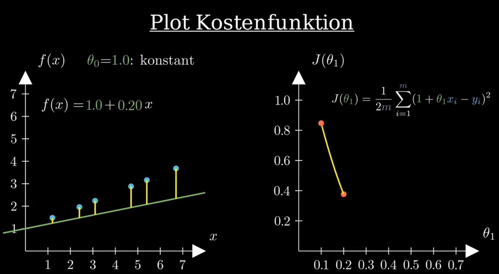

# Lineare Regression – Ein einfaches Machine Learning Modell

Die **lineare Regression** gehört zum **Supervised Learning** und dort im Speziellen zur Unterkategorie **Regression**. Das heißt, zur Anwendung der **linearen Regression** werden gelabelte Daten benötigt und der Output der **linearen Regression** ist ein numerischer Wert. Die **lineare Regression** beruht auf der Grundidee, den Zusammenhang zwischen den bekannten Features und der zu prädizierenden Variable durch eine **lineare Funktio**n beschreiben zu können. Im folgenden Artikel stelle ich euch das Model der **linearen Regression** und der zugehörigen Kostenfunktion einmal genauer vor.

## Regression für eine skalare Variable

Beginnen wir mit dem Fall einer **skalaren Variable** $`x`$. Ich greife hier erneut das Beispiel mit dem Schätzen von Immobilienpreisen aus dem ersten Artikel dieser Reihe auf. Ich gehe davon aus, dass die Variable $`x`$ für die Wohnfläche eines Hauses steht und die Variable $`y`$ für den Verkaufspreis eines Hauses. Die Funktion $`f(x)`$ ist dann das gewählte Model, in unserem Fall das der **linearen Regression**. Damit ist $`f(x)`$ eine **lineare Funktion** in $`x`$ mit den beiden Parametern $`\theta_0`$ und $`\theta_1`$:

$`f(x) = \theta_0 + \theta_1 x`$

Betrachten wir dazu einmal ein Koordinatensystem wie in der unteren Abbildung links, auf der die Wohnfläche auf der x-Achse und der Preis des Hauses auf der y-Achse aufgetragen ist. Nehmen wir einmal an, dass wir die blauen Datenpunkte gegeben haben. Eine lineare Funktion , die die Datenpunkte möglichst genau abbilden soll, könnte dann wie in der unteren rechten Abbildung in grüner Farbe dargestellt aussehen. Konkret ergibt sich bei dieser Funktion ein Wert von 58.300 für , welches man auch als y-Achsenabschnitt bezeichnet. Damit wäre ein Haus mit laut unseres Models 58.300€ wert. Das ist natürlich nicht wirklich realistisch, allerdings wird die Betrachtung von Häusern unter einer gewissen Größe sicherlich auch nicht praxisrelevant sein.

## Links

- [https://towardsdatascience.com/ordinary-least-squares-ols-deriving-the-normal-equation-8da168d740c](https://towardsdatascience.com/ordinary-least-squares-ols-deriving-the-normal-equation-8da168d740c)
- [https://eli.thegreenplace.net/2014/derivation-of-the-normal-equation-for-linear-regression/](https://eli.thegreenplace.net/2014/derivation-of-the-normal-equation-for-linear-regression/)
