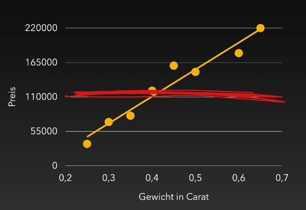

## Wiederholung Numpy Reshape

[Merkblatt_Lineare_Regression](pictures/Merkblatt_Lineare_Regression.pdf)

```python
import numpy as np

a = np.array([1, 2, 3, 4, 5, 6, 7, 8, 9, 10, 11, 12])
```

Die ML-Modelle erwarten die Datensätze meist in einem ganz speziellen Format.
In einem zweidimensionalen Format indem jede Zeile einem Datensatz entspricht.

```python
import numpy as np

a = np.array([1, 2, 3, 4, 5, 6, 7, 8, 9, 10, 11, 12])
print(a.reshape(-1,1))
[[ 1]
 [ 2]
 [ 3]
 [ 4]
 [ 5]
 [ 6]
 [ 7]
 [ 8]
 [ 9]
 [10]
 [11]
 [12]]
```

In ML-Modellen werden sehr oft Features (Spalten) verarbeitet. Um 5 Datensätze mit 2 Features zu erzeugen ist folgender Befehl notwendig.

```python
import numpy as np

a = np.array([1, 2, 3, 4, 5, 6, 7, 8, 9, 10, 11, 12])
print(a.reshape(-1,2))
[[ 1  2]
 [ 3  4]
 [ 5  6]
 [ 7  8]
 [ 9 10]
 [11 12]]
```

## Lineare Regression Grundlagen

Die Idee der Linearen Regression ist eine Geradengleichung zwischen den beteiligten Parametern zu ermitteln.


Man ermittelt ein Modell welchen die Parameter a und b der Geradengleichung bestimmt.


Man hat dann zwei y-Werte
- yi - echter y-Wert
- ydachi - Schätzung von einem y-Wert (aus der Geradengleichung vom Modell)

Das beste Modell (a,b) wird über den Fehlerterm E (oft auch mit S bezeichnet) bestimmt.

E wird aus der quadratischen Summe der Differenzen gebildet und danach mathematisch das Minimum dieses Fehlers gebildet.

Begriffe:
- die Messwerte werden als **Sample** bezeichnet
- die **Features** sind die Eigenschaften der Messung (z.B. Gewicht in Carat) - ein Modell kann auch mit mehreren Features arbeiten

### Warum quadratischer Abstand

```python
import numpy as np
import pandas as pd
import seaborn as sns

sns.set()

line_y = 3

xs = [1,2, 3, 4]
ys = [1, 5, 5, 1]

ax = sns.scatterplot(x =xs, y = ys, s = 100)
sns.lineplot(x = [0, 5], y = [line_y, line_y], ax = ax, color = "red");

# wenn line_y = 3, dann E = 16
# wenn line_y = 4, dann E = 20
```

## Lineare Regression

z.B. Der Preis von Diamanten abhängig vom Caratwert

```python
# y = ax + b
# Matplotlib config
%matplotlib inline
%config InlineBackend.figure_formats = ['svg']
%config InlineBackend.rc = {'figure.figsize': (5.0, 3.0)}

import numpy as np
import pandas as pd
import seaborn as sns

df = pd.read_csv("../data/Diamonds/diamonds.csv.bz2")

df.head()
```


Wir plotten erst einmal die Daten von einem Datensample mit 50 Punkten

```python
sns.scatterplot(x = "carat", y = "price", data = df.sample(50))
```


Man bekommt einen Zusammenhang, aber noch keine Gerade.

Wie geht man dabei vor? - die meisten ML-Modelle sind bereits in Python implementiert (sklearn und deren Unterpakete)

```python
from sklearn.linear_model import LinearRegression

xs = df["carat"].to_numpy().reshape(-1, 1)
#print(xs.shape)
ys = df["price"].to_numpy()
#print(ys.shape)

model = LinearRegression()
model.fit(xs, ys)
print(model.coef_)
print(model.intercept_)

[7756.42561797]
-2256.3605800453984
```

- Funktion LinearRegression vom sklearn.linear_model importieren
- danach ein entsprechendes Modell (model-Variable) generieren
- und über die Daten (xs,ys) lernen (model.fit) lassen
- die Daten müssen ein entsprechendes Format (**X : {array-like, sparse matrix} of shape (n_samples, n_features) Training data.**) haben - bei uns die Spaltendaten in ein numpy-Array umwandeln und danach reshapen (entsprechende Zeilen n_samples mit beliebigen Spalten n_features)
- ys ist ein einfaches numpy-Array

Es wurden die beiden Koeffizienten a (model.coef_) und b (model.intercept_) gelernt.

Die Gleichung für die Gerade lautet:<br>
**Preis = 7756.42561797 * {Gewicht in Karat} - 2256.3605800454247**

Wie wendet man diese Koeffizienten jetzt an?

Man könnte sich eine Funktion (z.B. get_price) schreiben und diese dann mit den jeweiligen Werten starten:
```python
def get_price(carat):
    return 7756.42561797 * carat - 2256.3605800454247

print(get_price(1))
print(get_price(10))

5500.065037924574
75307.89559965457
```

oder man verwendet eine Funktion (model.predict()) welche bereits im model implementiert ist. Dieses predict() unterstützt Vorhersagen für mehrere Werte, d.h. man muss die Übergabewerte in einem Array übergeben.
```python
model.predict(np.array([
    [10],
    [1]
]))

array([75307.89559964,  5500.06503792])
```

muss nicht unbedingt in ein numpy-Array übergeben werden
```python
model.predict([
    [10],
    [1]
])

array([75307.89559964,  5500.06503792])
```

### Plotten der Linearen Regressions

Mit der model.predict()-Funktion können wir uns die Ergebnisse ausrechnen

```python
x_pred = np.array([3, 0])
y_pred = model.predict(x_pred.reshape(-1, 1))

ax = sns.lineplot(x = x_pred, y = y_pred, color = "red")
sns.scatterplot(x = "carat", y = "price", data = df.sample(50), ax = ax)
```

- wir erzeugen ein np-array mit den entsprechenden x-Werten für die wir eine Vorhersage ausrechnen wollen
- bevor wir diese x-Werte der predict-Funktion übergeben müssen die Werte in ein 2-dimensionales Array umgewandelt werden (reshape)
- zwischen diesen beiden Vorhersagewerten wird danach eine rote Linie gezeichnet und alles mit einem scatterplot ausgegeben.


### Linearen Regressions mit mehreren Features

Dabei geht es darum auf Basis mehrerer Spalten (Features) ein besseres Modell zu entwickeln.

z.B. auf Basis des Gewichts (carat) und der Breite (x) einen Preis ermitteln

```
price = carat * a + x * b + c
```

Das Modell muss daher a, b und c lernen

```python
from sklearn.linear_model import LinearRegression

model = LinearRegression()

X_train = df[["carat", "x"]]
y_train = df["price"]

#print(X_train.shape)
#print(y_train.shape)

model.fit(X_train, y_train)

print(model.coef_)
print(model.intercept_)

[10125.98767084 -1026.85685415]
1737.94973798387
```

Durch die predic-Funktion kann man sich die Vorhersagen wieder ausrechnen (auch mehrere Werte möglich - Verschachtelung beachten)
```python
X_pred = np.array([
    [0.5, 5],
    [0.25, 3]
])

y_pred = model.predict(X_pred)
print(y_pred)

[1666.65930266 1188.87609325]
```

## Regressionsmodell bewerten / Bestimmtheitsmaß R<sup>2</sup>

[Merkblatt_Bestimmtheitsmaß](pdfs/Merkblatt_Bestimmtheitsmaß.pdf)

Dabei geht es darum wie man die verschiedenen Modelle bewerten kann.
Im eindimensionalen konnte man das Ergebnis plotten, aber bei mehreren Parametern (Features) braucht man ein eigenes Bewertungsschema (ein mathematisches Maß wie man die Güte oder Qualität bewertet)

Diese Güte wird **Bestimmtheitsmaß** oder **R<sup>2</sup>** genannt.

Idee für R<sup>2</sup>-Score
- Wir berechnen den "Fehler" für ein richtig schlechtes Modell
- Wie gut ist unser Modell besser, als das richtig schlechte Modell?

Aber: Was ist ein richtig schlechtes Modell?
- Ein Modell, welches unsere Eingabedaten gar nicht wirklich betrachtet
- Aber es darf auch nicht zu sehr daneben liegen
- => Wir schätzen immer den Durchschnitt von den Daten, die wir gelernt haben

Beispiel:<br>


Man bestimmt unabhängig vom der x-Achse (Carat) einen Mittelwert der y-Achse (Preis). Dieses schlechte Modell ist vollkommen unabhängig von den Eingabeparametern.

Zudem soll gelten:
- Man hat dann 2 Modelle (z.B. Lineares Regressionsmodell und Durchschnittsmodell)
- Wert 1, wenn unser Modell die Daten perfekt beschreibt
- Wert 0, wenn unser Modell die Daten genauso gut wie im Durchschnittsmodell beschreibt
- Wert von unter 0, wenn es noch schlechter als der Durchschnitt ist

Man kann dies auch in eine mathematische Formel gießen:<br>


```math
R^2 = \sum_{i=1}^{n} \left(\hat{y_i} - \bar{y}\right)^2/\sum_{i=1}^{n} \left(y_i - \bar{y}\right)^2
```

Man muss dieses Bestimmtheitsmaß nicht selbst berechnen - bereits implementiert.

## Bestimmtheitsmaß R<sup>2</sup> in Python

```python
# Matplotlib config
%matplotlib inline
%config InlineBackend.figure_formats = ['svg']
%config InlineBackend.rc = {'figure.figsize': (5.0, 3.0)}

import numpy as np
import pandas as pd
import seaborn as sns

df = pd.read_csv("../data/Diamonds/diamonds.csv.bz2")

df.head()
```

```python
from sklearn.linear_model import LinearRegression

xs = df["carat"].to_numpy().reshape(-1, 1)
ys = df["price"]

model = LinearRegression()
model.fit(xs, ys)
```

- ys sind die echten Preisdaten
- y_pred sind die mittels Vorhersagen (model.predict) gewonnenen Daten

```python
from sklearn.metrics import r2_score

#r2_score?
y_pred = model.predict(xs)
r2_score(ys, y_pred)

0.8493305264354858
```

Da es sich um eine so essetielle Metrik handelt gibt es dafür auch eine fertige Funktion (**model.score**). Achtung: es müssen jedoch andere Werte übergeben werden.
```python
model.score?
print(model.score(xs, ys))

0.8493305264354858
```

### Modelle vergleichen

```python
from sklearn.linear_model import LinearRegression

xs = df["carat"].to_numpy().reshape(-1, 1)
ys = df["price"]

model = LinearRegression()
model.fit(xs, ys)

print(model.score(xs, ys))

0.8493305264354857
```

Ein Modell mit 2 Features:

```python
from sklearn.linear_model import LinearRegression

#print(df[["carat", "x"]].to_numpy())
xs = df[["carat", "x"]]
ys = df["price"]

model = LinearRegression()
model.fit(xs, ys)

print(model.score(xs, ys))

0.8534314749939833
```

Wir gewinnen ein etwas höheres Bestimmtheitsmaß

Nachteil: für die Vorhersagen muss ich beim zweiten Modell auch 2 Parameter angeben

Problem: Wir berechnen das Bestimmtheitsmaß nicht auf irgendwelche zukünftigen Daten, sondern auf Daten mit denen wir bereits das Modell trainiert haben.

### Daten mit test/train aufteilen

Uns interessiert nicht das Bestimmtheitsmaß auf Daten die das Modell bereits gesehen hat, sondern auf Daten die das Modell noch nicht gesehen hat.

Die Idee dahinter ist, dass man das Modell nur mit einem Teil der Daten trainiert und mit dem Rest der Daten testet

Man kann dies "zu Fuss" realisieren
```python
# Test / Train
print(len(df))
53940

df_train = df.iloc[:40000] # die ersten 40000-Zeilen sind Trainingsdaten
df_test = df.iloc[40000:]  # die Testdaten sind ab der 40000sten Zeile
```
```python
from sklearn.linear_model import LinearRegression

X_train = df_train["carat"].to_numpy().reshape(-1, 1)
y_train = df_train["price"]

model = LinearRegression()
model.fit(X_train, y_train)

X_test = df_test["carat"].to_numpy().reshape(-1, 1)
y_test = df_test["price"]

print(model.score(X_test, y_test))

-1.0517239092305672
```

Warum ergibt dies so einen schlechten Score (Bestimmtheitsmaß)?
- die Daten sind nach aufsteigendem Preis sortiert
- damit sind die günstigen Diamanten am Anfang und die teuersten am Ende
- wir haben somit nur mit den günstigeren Diamanten (die ersten 40000) trainiert
- aber mit den teuren Diamanten getestet

Lösung: Daten neu sortieren
```python
from sklearn.linear_model import LinearRegression

df = df.sample(frac = 1) # mischt die kompletten Daten
df_train = df.iloc[:40000] # iloc verwenden, da loc den falschen Index liefert
df_test = df.iloc[40000:]

X_train = df_train["carat"].to_numpy().reshape(-1, 1)
y_train = df_train["price"]

model = LinearRegression()
model.fit(X_train, y_train)

X_test = df_test["carat"].to_numpy().reshape(-1, 1)
y_test = df_test["price"]

print(model.score(X_test, y_test))

0.8452169386942134
```

### Daten mit test_train_split aufteilen

Aufteilung der Trainings- und Testdaten mithilfe einer Funktion (**test_train_split()**)

```python
from sklearn.model_selection import train_test_split

#train_test_split?
train, test = train_test_split([1, 2, 3, 4, 5, 6, 7, 8, 9, 10], train_size = 0.75)
print(train)
print(test)

[4, 10, 9, 6, 7, 5, 1]
[8, 3, 2]
```

Man kann der Funktion auch gleich mehrere Arrays übergeben. Die Aufteilung über beide Listen erfolgt identisch.
```python
train_test_split([1, 2, 3, 4, 5, 6, 7, 8, 9, 10], [101, 102, 103, 104, 105, 106, 107, 108, 109, 1010])

[[6, 1, 4, 7, 5, 8, 2],
 [9, 3, 10],
 [106, 101, 104, 107, 105, 108, 102],
 [109, 103, 1010]]
```

```python
X = df[["carat"]]
y = df["price"]

X_train, X_test, y_train, y_test = train_test_split(X, y, train_size = 0.75, random_state = 42)
```
train_test_split()
- train_size bestimmt die Aufteilung in Train- und Testdaten
- random_state mit irgendeiner Zahl initialisieren
- liefert eine verschachtelte Liste zurück, die man aber normalerweise gleich den entsprechenden Variablen zuweist

```python
from sklearn.linear_model import LinearRegression

model = LinearRegression()
model.fit(X_train, y_train)

print(model.score(X_test, y_test))

0.8452169386942134
```

Man kann die Aufteilung leicht auf mehrere Spalten erweitern und bekommt leicht ein anderes Bestimmtheitsmaß
```python
X = df[["carat", "x"]]
y = df["price"]

X_train, X_test, y_train, y_test = train_test_split(X, y, train_size = 0.75, random_state = 42)

from sklearn.linear_model import LinearRegression

model = LinearRegression()
model.fit(X_train, y_train)

print(model.score(X_test, y_test))

0.8532274320378628
```

