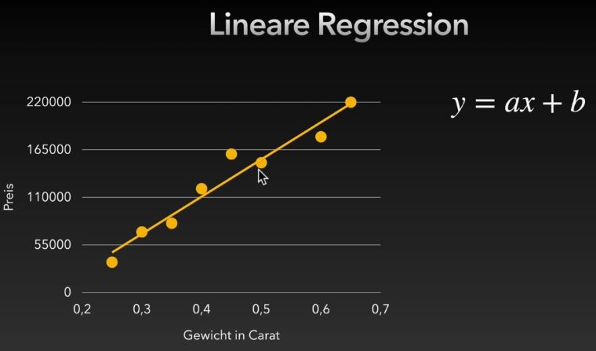
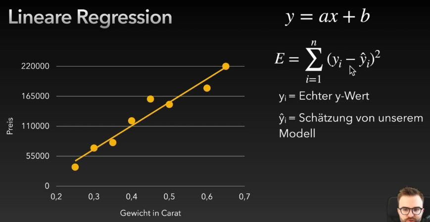
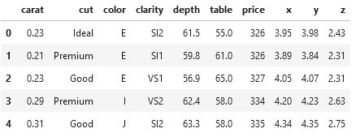
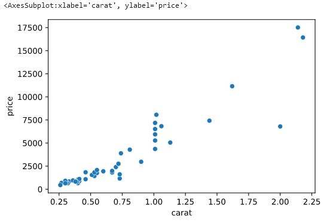
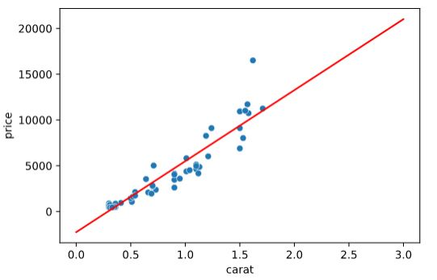

## Wiederholung Numpy Reshape

[Merkblatt_Lineare_Regression](pictures/Merkblatt_Lineare_Regression.pdf)

```python
import numpy as np

a = np.array([1, 2, 3, 4, 5, 6, 7, 8, 9, 10, 11, 12])
```

Die ML-Modelle erwarten die Datensätze meist in einem ganz speziellen Format.
In einem zweidimensionalen Format indem jede Zeile einem Datensatz entspricht.

```python
import numpy as np

a = np.array([1, 2, 3, 4, 5, 6, 7, 8, 9, 10, 11, 12])
print(a.reshape(-1,1))
[[ 1]
 [ 2]
 [ 3]
 [ 4]
 [ 5]
 [ 6]
 [ 7]
 [ 8]
 [ 9]
 [10]
 [11]
 [12]]
```

In ML-Modellen werden sehr oft Features (Spalten) verarbeitet. Um 5 Datensätze mit 2 Features zu erzeugen ist folgender Befehl notwendig.

```python
import numpy as np

a = np.array([1, 2, 3, 4, 5, 6, 7, 8, 9, 10, 11, 12])
print(a.reshape(-1,2))
[[ 1  2]
 [ 3  4]
 [ 5  6]
 [ 7  8]
 [ 9 10]
 [11 12]]
```

## Lineare Regression Grundlagen

Die Idee der Linearen Regression ist eine Geradengleichung zwischen den beteiligten Parametern zu ermitteln.



Man ermittelt ein Modell welchen die Parameter a und b der Geradengleichung bestimmt.



Man hat dann zwei y-Werte
- yi - echter y-Wert
- ydachi - Schätzung von einem y-Wert (aus der Geradengleichung vom Modell)

Das beste Modell (a,b) wird über den Fehlerterm E (oft auch mit S bezeichnet) bestimmt.

E wird aus der quadratischen Summe der Differenzen gebildet und danach mathematisch das Minimum dieses Fehlers gebildet.

Begriffe:
- die Messwerte werden als **Sample** bezeichnet
- die **Features** sind die Eigenschaften der Messung (z.B. Gewicht in Carat) - ein Modell kann auch mit mehreren Features arbeiten

### Warum quadratischer Abstand

```python
import numpy as np
import pandas as pd
import seaborn as sns

sns.set()

line_y = 3

xs = [1,2, 3, 4]
ys = [1, 5, 5, 1]

ax = sns.scatterplot(x =xs, y = ys, s = 100)
sns.lineplot(x = [0, 5], y = [line_y, line_y], ax = ax, color = "red");

# wenn line_y = 3, dann E = 16
# wenn line_y = 4, dann E = 20
```

## Lineare Regression

z.B. Der Preis von Diamanten abhängig vom Caratwert

```python
# y = ax + b
# Matplotlib config
%matplotlib inline
%config InlineBackend.figure_formats = ['svg']
%config InlineBackend.rc = {'figure.figsize': (5.0, 3.0)}

import numpy as np
import pandas as pd
import seaborn as sns

df = pd.read_csv("../data/Diamonds/diamonds.csv.bz2")

df.head()
```


Wir plotten erst einmal die Daten von einem Datensample mit 50 Punkten

```python
sns.scatterplot(x = "carat", y = "price", data = df.sample(50))
```


Man bekommt einen Zusammenhang, aber noch keine Gerade.

Wie geht man dabei vor? - die meisten ML-Modelle sind bereits in Python implementiert (sklearn und deren Unterpakete)

```python
from sklearn.linear_model import LinearRegression

xs = df["carat"].to_numpy().reshape(-1, 1)
#print(xs.shape)
ys = df["price"].to_numpy()
#print(ys.shape)

model = LinearRegression()
model.fit(xs, ys)
print(model.coef_)
print(model.intercept_)

[7756.42561797]
-2256.3605800453984
```

- Funktion LinearRegression vom sklearn.linear_model importieren
- danach ein entsprechendes Modell (model-Variable) generieren
- und über die Daten (xs,ys) lernen (model.fit) lassen
- die Daten müssen ein entsprechendes Format (**X : {array-like, sparse matrix} of shape (n_samples, n_features) Training data.**) haben - bei uns die Spaltendaten in ein numpy-Array umwandeln und danach reshapen (entsprechende Zeilen n_samples mit beliebigen Spalten n_features)
- ys ist ein einfaches numpy-Array

Es wurden die beiden Koeffizienten a (model.coef_) und b (model.intercept_) gelernt.

Die Gleichung für die Gerade lautet:<br>
**Preis = 7756.42561797 * {Gewicht in Karat} - 2256.3605800454247**

Wie wendet man diese Koeffizienten jetzt an?

Man könnte sich eine Funktion (z.B. get_price) schreiben und diese dann mit den jeweiligen Werten starten:
```python
def get_price(carat):
    return 7756.42561797 * carat - 2256.3605800454247

print(get_price(1))
print(get_price(10))

5500.065037924574
75307.89559965457
```

oder man verwendet eine Funktion (model.predict()) welche bereits im model implementiert ist. Dieses predict() unterstützt Vorhersagen für mehrere Werte, d.h. man muss die Übergabewerte in einem Array übergeben.
```python
model.predict(np.array([
    [10],
    [1]
]))

array([75307.89559964,  5500.06503792])
```

muss nicht unbedingt in ein numpy-Array übergeben werden
```python
model.predict([
    [10],
    [1]
])

array([75307.89559964,  5500.06503792])
```

### Plotten der Linearen Regressions

Mit der model.predict()-Funktion können wir uns die Ergebnisse ausrechnen

```python
x_pred = np.array([3, 0])
y_pred = model.predict(x_pred.reshape(-1, 1))

ax = sns.lineplot(x = x_pred, y = y_pred, color = "red")
sns.scatterplot(x = "carat", y = "price", data = df.sample(50), ax = ax)
```

- wir erzeugen ein np-array mit den entsprechenden x-Werten für die wir eine Vorhersage ausrechnen wollen
- bevor wir diese x-Werte der predict-Funktion übergeben müssen die Werte in ein 2-dimensionales Array umgewandelt werden (reshape)
- zwischen diesen beiden Vorhersagewerten wird danach eine rote Linie gezeichnet und alles mit einem scatterplot ausgegeben.



### Linearen Regressions mit mehreren Features

Dabei geht es darum auf Basis mehrerer Spalten (Features) ein besseres Modell zu entwickeln.

z.B. auf Basis des Gewichts (carat) und der Breite (x) einen Preis ermitteln

```
price = carat * a + x * b + c
```

Das Modell muss daher a, b und c lernen

```python
from sklearn.linear_model import LinearRegression

model = LinearRegression()

X_train = df[["carat", "x"]]
y_train = df["price"]

#print(X_train.shape)
#print(y_train.shape)

model.fit(X_train, y_train)

print(model.coef_)
print(model.intercept_)

[10125.98767084 -1026.85685415]
1737.94973798387
```

Durch die predic-Funktion kann man sich die Vorhersagen wieder ausrechnen (auch mehrere Werte möglich - Verschachtelung beachten)
```python
X_pred = np.array([
    [0.5, 5],
    [0.25, 3]
])

y_pred = model.predict(X_pred)
print(y_pred)

[1666.65930266 1188.87609325]
```
